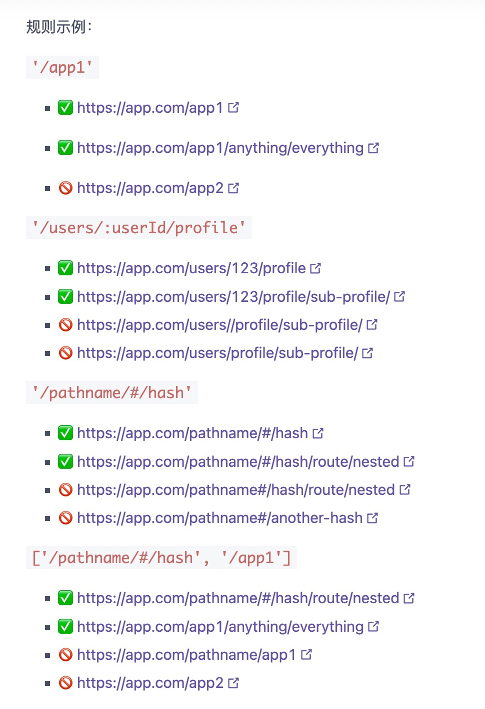

# qiankun 实践

qiankun 是一个基于 single-spa 的微前端实现库，旨在帮助大家能更简单、无痛的构建一个生产可用微前端架构系统。

qiankun 孵化自蚂蚁金融科技基于微前端架构的云产品统一接入平台，在经过一批线上应用的充分检验及打磨后，我们将其微前端内核抽取出来并开源，希望能同时帮助社区有类似需求的系统更方便的构建自己的微前端系统，同时也希望通过社区的帮助将 qiankun 打磨的更加成熟完善。

目前 qiankun 已在蚂蚁内部服务了超过 200+ 线上应用，在易用性及完备性上，绝对是值得信赖的。

[qiankun](https://qiankun.umijs.org/zh/guide)

## 什么是微前端

微前端是一种类似于微服务的架构，它将微服务的理念应用于浏览器端，即将单页面前端应用由单一的单体应用转变为把多个小型前端应用聚合为一的应用。各个前端应用还可以独立开发、独立部署。同时，它们也可以进行并行开发——这些组件可以通过 NPM、Git TagGit 或者 Submodule 来管理。

[微前端设计](../微前端设计) 一文中已经详细介绍了微前端的相关知识，这里就不在赘述。

## 为什么不是 iframe？

1. url 不同步。浏览器刷新 iframe url 状态丢失、后退前进按钮无法使用。
2. UI 不同步，DOM 结构不共享。想象一下屏幕右下角 1/4 的 iframe 里来一个带遮罩层的弹框，同时我们要求这个弹框要浏览器居中显示，还要浏览器 resize 时自动居中..
3. 全局上下文完全隔离，内存变量不共享。iframe 内外系统的通信、数据同步等需求，主应用的 cookie 要透传到根域名都不同的子应用中实现免登效果。
4. 慢。每次子应用进入都是一次浏览器上下文重建、资源重新加载的过程。

## qiankun 中注册微应用

qiankun 提供了两种模式用来注册微应用：

-   基于路由配置。通过将微应用关联到一些 url 规则的方式，实现当浏览器 url 发生变化时，自动加载相应的微应用的功能。
-   手动加载微应用。适用于需要手动 加载/卸载 一个微应用的场景。

### 基于路由配置

_通过将微应用关联到一些 url 规则的方式，实现当浏览器 url 发生变化时，自动加载相应的微应用的功能。_

1. 渲染主应用，url 进行匹配对应的子应用，进行渲染。
1. qiankun 监听 url 的变化，进行切换子应用， 创建一个新的实例。
1. 之前的实例直接抛弃不用，所以在子应用卸载时，需要手动销毁实例。

_registerMicroApps_ ####参数 - apps - Array<RegistrableApp> - 必选，微应用的一些注册信息 - lifeCycles - LifeCycles - 可选，全局的微应用生命周期钩子

#### 类型

-   name - string - 必选，微应用的名称，微应用之间必须确保唯一。
-   entry - string | { scripts?: string[]; styles?: string[]; html?: string } - 必选，微应用的入口。
    -   配置为字符串时，表示微应用的访问地址，例如 https://qiankun.umijs.org/guide/。
    -   配置为对象时，html 的值是微应用的 html 内容字符串，而不是微应用的访问地址。微应用的 publicPath 将会被设置为 /。
-   container - string | HTMLElement - 必选，微应用的容器节点的选择器或者 Element 实例。如 container: '#root' 或 container: document.querySelector('#root')。
-   activeRule - string | (location: Location) => boolean | Array<string | (location: Location) => boolean> - 必选，微应用的激活规则。 - 支持直接配置字符串或字符串数组，如 activeRule: '/app1' 或 activeRule: ['/app1', '/app2']，当配置为字符串时会直接跟 url 中的路径部分做前缀匹配，匹配成功表明当前应用会被激活。 - 支持配置一个 active function 函数或一组 active function。函数会传入当前 location 作为参数，函数返回 true 时表明当前微应用会被激活。如 location => location.pathname.startsWith('/app1')。
    规则实例

    

    浏览器 url 发生变化会调用 activeRule 里的规则，activeRule 任意一个返回 true 时表明该微应用需要被激活。

-   loader - (loading: boolean) => void - 可选，loading 状态发生变化时会调用的方法。
-   props - object - 可选，主应用需要传递给微应用的数据。

_LifeCycles_

-   beforeLoad - Lifecycle | Array<Lifecycle> - 可选
-   beforeMount - Lifecycle | Array<Lifecycle> - 可选
-   afterMount - Lifecycle | Array<Lifecycle> - 可选
-   beforeUnmount - Lifecycle | Array<Lifecycle> - 可选
-   afterUnmount - Lifecycle | Array<Lifecycle> - 可选

#### 示例

```js
import { registerMicroApps } from 'qiankun';

registerMicroApps(
    [
        {
            name: 'api',
            entry: 'http://dev.dtstack.cn:7002/dataApi/#',
            container: '#subapp-viewport',
            activeRule: '/dataApi/#',
            props: {
                name: 'kuitos'
            }
        }
    ],
    {
        beforeLoad: (app) => console.log('before load', app.name),
        beforeMount: [(app) => console.log('before mount', app.name)]
    }
);

start(); // 启动
```

### 手动加载微应用

1. 使用 loadMicroApp 进行手动注册微应用。
1. 每个子应用都有一个唯一的实例 ID，reload 时会复用之前的实例。
1. 如果需要卸载则需要手动卸载 xxxMicroApp.unmount()

_loadMicroApp(app, configuration?)_

#### 参数

-   app - LoadableApp - 必选，微应用的基础信息
    -   name - string - 必选，微应用的名称，微应用之间必须确保唯一。
    -   entry - string | { scripts?: string[]; styles?: string[]; html?: string } - 必选，微应用的入口（详细说明同上）。
    -   container - string | HTMLElement - 必选，微应用的容器节点的选择器或者 Element 实例。如 container: '#root' 或 container: document.querySelector('#root')。
    -   props - object - 可选，初始化时需要传递给微应用的数据。
-   configuration - Configuration - 可选，微应用的配置信息
    -   sandbox - boolean | { strictStyleIsolation?: boolean, experimentalStyleIsolation?: boolean } - 可选，是否开启沙箱，默认为 true。
    -   singular - boolean | ((app: RegistrableApp<any>) => Promise<boolean>); - 可选，是否为单实例场景，单实例指的是同一时间只会渲染一个微应用。默认为 false。
    -   fetch - Function - 可选，自定义的 fetch 方法。
    -   getPublicPath - (entry: Entry) => string - 可选，参数是微应用的 entry 值。
    -   getTemplate - (tpl: string) => string - 可选
    -   excludeAssetFilter - (assetUrl: string) => boolean - 可选，指定部分特殊的动态加载的微应用资源（css/js) 不被 qiankun 劫持处理

#### 返回值 - MicroApp - 微应用实例

-   mount(): Promise<null>;
-   unmount(): Promise<null>;
-   update(customProps: object): Promise<any>;
-   getStatus(): | "NOT_LOADED" | "LOADING_SOURCE_CODE" | "NOT_BOOTSTRAPPED" | "BOOTSTRAPPING" | "NOT_MOUNTED" | "MOUNTING" | "MOUNTED" | "UPDATING" | "UNMOUNTING" | "UNLOADING" | "SKIP_BECAUSE_BROKEN" | "LOAD_ERROR";
-   loadPromise: Promise<null>;
-   bootstrapPromise: Promise<null>;
-   mountPromise: Promise<null>;
-   unmountPromise: Promise<null>;

#### 示例

```js
import { loadMicroApp } from 'qiankun';
import React from 'react';

class App extends React.Component {
    containerRef = React.createRef();
    microApp = null;

    componentDidMount() {
        this.microApp = loadMicroApp({
            name: 'app1',
            entry: '//localhost:1234',
            container: this.containerRef.current,
            props: { brand: 'qiankun' }
        });
    }

    componentWillUnmount() {
        this.microApp.unmount();
    }

    componentDidUpdate() {
        this.microApp.update({ name: 'kuitos' });
    }

    render() {
        return <div ref={this.containerRef}></div>;
    }
}
```

## 挂载节点

_微应用可以挂载在页面的任意位置，微应用、微项目、微页面、微组件，一切皆有可能。_

大多数情况下。微应用都是内嵌进页面进行使用

找到对应的 DOM 元素，挂载到这个 DOM 元素内部。

```html
<main id="micro-container"></main>
```

还有一种根 DOM 中与主应用同级挂载，切换的时候隐藏应用，显示当前应用，类似于 tabs 切换，没实际体验过，不进行说明。

## 预加载微应用

在 qiankun 中开启预加载也基于自动和手动注册两种方式对应的预加载。

### 自动

_start(opts?)_

-   prefetch - boolean | 'all' | string[] | (( apps: RegistrableApp[] ) => { criticalAppNames: string[]; minorAppsName: string[] }) - 可选，是否开启预加载，默认为 true。
-   配置为 true 则会在第一个微应用 mount 完成后开始预加载其他微应用的静态资源
-   配置为 'all' 则主应用 start 后即开始预加载所有微应用静态资源
-   配置为 string[] 则会在第一个微应用 mounted 后开始加载数组内的微应用资源
-   配置为 function 则可完全自定义应用的资源加载时机 (首屏应用及次屏应用)

```js
import { registerMicroApps, start } from 'qiankun';

registerMicroApps([...AppsConfig]);

start({ prefetch: 'all' }); // 配置预加载
```

### 手动 prefetchApps 预加载

与 loadMicroApp 类似，提供了 prefetchApps 方法进行注册预加载的子应用。

_prefetchApps(apps, importEntryOpts?)_

#### 参数

-   apps - AppMetadata[] - 必选 - 预加载的应用列表
-   importEntryOpts - 可选 - 加载配置

#### 类型

-   AppMetadata
    -   name - string - 必选 - 应用名
    -   entry - string | { scripts?: string[]; styles?: string[]; html?: string } - 必选，微应用的 entry 地址

#### 示例

```js
import { prefetchApps } from 'qiankun';

prefetchApps([
    { name: 'app1', entry: '//localhost:7001' },
    { name: 'app2', entry: '//localhost:7002' }
]);
```

## 微应用的路由模式如何选择

主流的 router 方案都支持 hash 和 history 模式，

### activeRule 使用 location.pathname 区分微应用

主应用使用 location.pathname 来区分微应用时，微应用可以是 hash 和 history 模式。

注册微应用时 activeRule 这样写即可：

```js
registerMicroApps([
    {
        name: 'app',
        entry: 'http://localhost:8080',
        container: '#container',
        activeRule: '/app'
    }
]);
```

### activeRule 使用 location.hash 区分微应用

当微应用都是 hash 模式时可以使用 hash 区分微应用，主应用的路由模式不限。

注册微应用时 activeRule 需要这样写：

```js
const getActiveRule = (hash) => (location) => location.hash.startsWith(hash);
registerMicroApps([
    {
        name: 'app-hash',
        entry: 'http://localhost:8080',
        container: '#container',
        activeRule: getActiveRule('#/app-hash')
        // 这里也可以直接写 activeRule: '#/app-hash'，但是如果主应用是 history 模式或者主应用部署在非根目录，这样写不会生效。
    }
]);
```

### 路由改造工作

我们在子应用中配置路由时基本都是从根路径 `/` 开始进行配置。

在接入 qiankun 后，就需要对这块进行改造。通过判断 `window.__POWERED_BY_QIANKUN__` 是否在 qiankun 中，如果在需要新增微应用路由前缀。

新增前缀不是微应用必须的，但是为了从 URL 上与其他应用隔离，也是为了接入旧应用的时候，能让 activeRule 方法能识别并激活应用，故新增路由前缀。

```js
routes: [
    {
        //增加路由前缀判断
        path: window.__POWERED_BY_QIANKUN__ ? '/app' : '/',
        component: _import('login/index.vue')
    }
];
```

当然了，不只是在配置路由的时候，有涉及到路由的位置，也需要增加微应用前缀。


## 参考文档


4、生命周期
5、路由
9、问题，踩坑点
