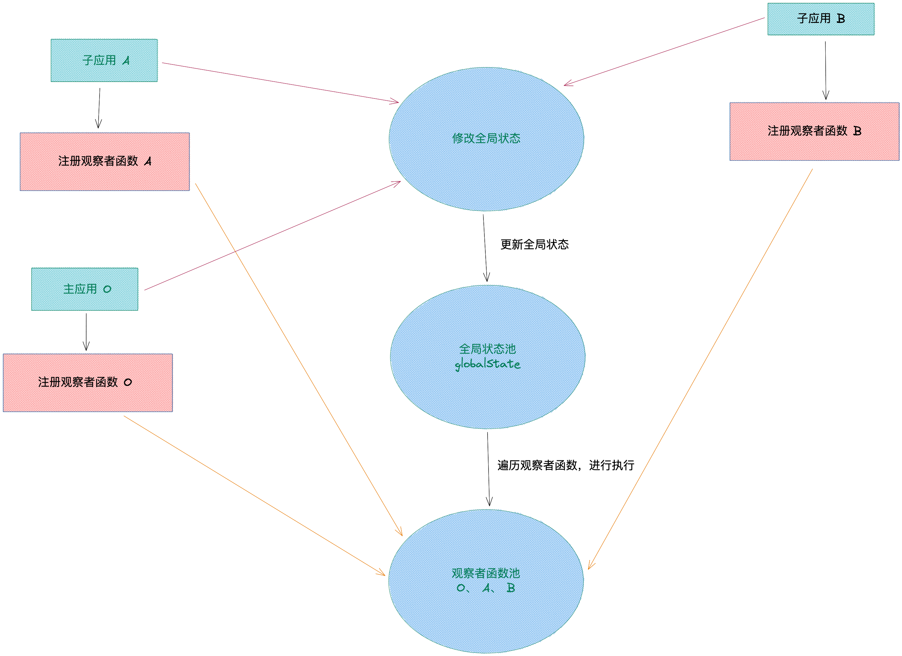

## 应用通信

应用通信一般指的是父子应用间的通信。

这里的父子应用通信指的是，主应用与子应用之间的通信。

我们可以使用 qiankun 提供 initGlobalState API 进行通信。

### initGlobalState

官方提供的 initGlobalState 通信方式是通过全局状态池和观察者函数进行应用间的通信。



在加载应用时，注册各个子应用的观察者函数，放进观察者函数池子里。当应用使用 setGlobalState 方法修改了全局状态池 globalState 时，遍历观察者函数池子，一一执行每个观察者函数。

#### 用法

定义全局状态，并返回通信方法，建议在主应用使用，微应用通过 props 获取通信方法。

#### 返回

返回一个 `MicroAppStateActions` 对象，对象内存在 3 个属性用来管理 `initGlobalState`

-   MicroAppStateActions
    -   onGlobalStateChange: (callback: OnGlobalStateChangeCallback, fireImmediately?: boolean) => void， 在当前应用监听全局状态，有变更触发 callback，fireImmediately = true 立即触发 callback
    -   setGlobalState: (state: Record<string, any>) => boolean， 按一级属性设置全局状态，微应用中只能修改已存在的一级属性
    -   offGlobalStateChange: () => boolean，移除当前应用的状态监听，微应用 umount 时会默认调用

#### 示例

##### 主应用:

```js
const { onGlobalStateChange, setGlobalState } = initGlobalState({
    user: 'qiankun'
});

onGlobalStateChange((value, prev) =>
    console.log('[onGlobalStateChange - master]:', value, prev)
);

setGlobalState({
    ignore: 'master',
    user: {
        name: 'master'
    }
});
```

##### 子应用：

```js
export async function mount(props) {
    const { onGlobalStateChange, setGlobalState } = props;
    render(props);
}

const render = (props: any) => {
    const { onGlobalStateChange, setGlobalState } = props;
    const modifyGlobalState = (state) => {
        setGlobalState(state);
    };
    ReactDOM.render(
        <Root
            onGlobalStateChange={onGlobalStateChange}
            modifyGlobalState={modifyGlobalState}
        />,
        document.getElementById('app')
    );
};
```

> PS: setGlobalState 方法只会修改在主应用注册的一级属性，如果修改的是没有注册过的属性，则不会生效，且不会触发 onGlobalStateChange 方法。

### shared 方案

使用官方提供的 initGlobalState 的，就可以应付大多数场景，有点也是非常明显的：

-   使用简单
-   官方背书
-   上手快速

然而也是有缺点的：

-   子应用需要先了解主应用的状态池细节，才能开始通信。
-   在复杂场景下，无法根据数据变化，维护困难。

为了让子应用能够独立运行，在主应用没有提供通信状体时，也能过正常运行，且可以独立维护一个状态，我们就可以采用 shared 的方式进行通信。

#### 用法

Shared 通信方案的原理就是，主应用基于 redux 维护一个状态池，通过 shared 实例暴露一些方法给子应用使用。同时，子应用需要单独维护一份 shared 实例，在独立运行时使用自身的 shared 实例，在嵌入主应用时使用主应用的 shared 实例，这样就可以保证在使用和表现上的一致性。

#### 示例

##### 主应用
```js
// main/shared/store.js
import { createStore } from 'redux';

const reducer = (state= {}, action) => {
    switch (action.type) {
        default:
            return state;
        // 设置 Token
        case 'SET_TOKEN':
            return {
                ...state,
                token: action.payload
            };
    }
};

const store = createStore(reducer);

export default store;
```

```js
// main/shared/shared.js
import store from './store.js';

class Shared {
    /**
     * 获取 Token
     */
    getToken() {
        const state = store.getState();
        return state.token || '';
    }

    /**
     * 设置 Token
     */
    setToken(token) {
        // 将 token 的值记录在 store 中
        store.dispatch({
            type: 'SET_TOKEN',
            payload: token
        });
    }
}

const shared = new Shared();
export default shared;
```

```js
// main/shared/shared.js
import store from './store.js';

class Shared {
    /**
     * 获取 Token
     */
    getToken() {
        const state = store.getState();
        return state.token || '';
    }

    /**
     * 设置 Token
     */
    setToken(token) {
        // 将 token 的值记录在 store 中
        store.dispatch({
            type: 'SET_TOKEN',
            payload: token
        });
    }
}

const shared = new Shared();
export default shared;
```

```js
// main/index.js
import shared from './shared/shared.js';

/** 
 *
 * 忽略代码
 *
 **/

registerMicroApps(
    [
        {
            name: 'api',
            entry: 'http://local.dtstackv51.cn:7002/dataApi/#',
            container: '#subapp-viewport',
            loader,
            activeRule: '/dataApi/#',
            props: {
                shared // 增加props参数
            }
        }
    ],
   
);
```

##### 子应用
```js
// dt-data-api/src/shared.js
class Shared {
    /**
     * 获取 Token
     */
    getToken() {
        // 子应用独立运行时，在 localStorage 中获取 token
        return localStorage.getItem('token') || '';
    }

    /**
     * 设置 Token
     */
    setToken(token) {
        // 子应用独立运行时，在 localStorage 中设置 token
        localStorage.setItem('token', token);
    }
}

class SharedModule {
    static shared = new Shared();

    /**
     * 重载 shared
     */
    static overloadShared(shared) {
        SharedModule.shared = shared;
    }

    /**
     * 获取 shared 实例
     */
    static getShared() {
        return SharedModule.shared;
    }
}

export default SharedModule;
```

```js
// dt-data-api/src/app.tsx
import SharedModule from './shared.js';

/** 
 *
 * 忽略代码
 *
 **/

export async function mount(props) {
    const {
        shared = SharedModule.getShared()
    } = props;
    SharedModule.overloadShared(shared);
    
    render(props);
}
```

```js
// dt-data-api/src/app.tsx
import SharedModule from './shared';

/** 
 *
 * 忽略代码
 *
 **/

const share = SharedModule.getShared();
share.setToken('token');
share.getToken()
```

### window 挂载

在 qiankun 中，利用 fakeWindow 进行模拟 window 对象，而 window 本身还是全局共享的。

可以利用 window 在主应用以及子应用唯一且共享的特点，在 window 对象上挂载方法，使得主应用以及子应用共同访问 window 上的同一个方法属性，达到通信的效果。

#### 用法

##### 主应用

```js
let state = {
    user: 'qiankun'
};

const removeState = () => {
    state = {};
};

window.customInterflow = {
    getState: () => {
        return state;
    },
    setState: (newState) => {
        state = { ...state, ...newState };
    },
    removeState: () => {
        removeState();
    }
};
```

##### 子应用

```js
// 直接从 window 上访问就可以了
window.customInterflow.getState();
```
