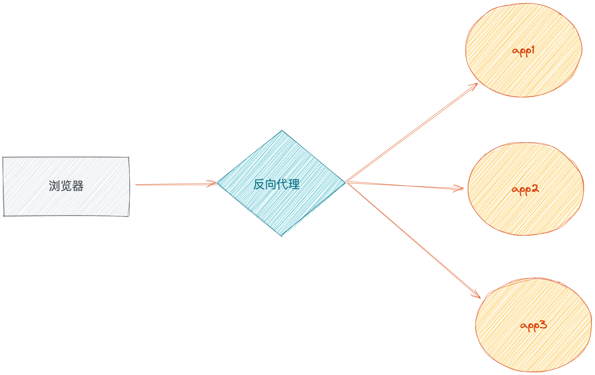
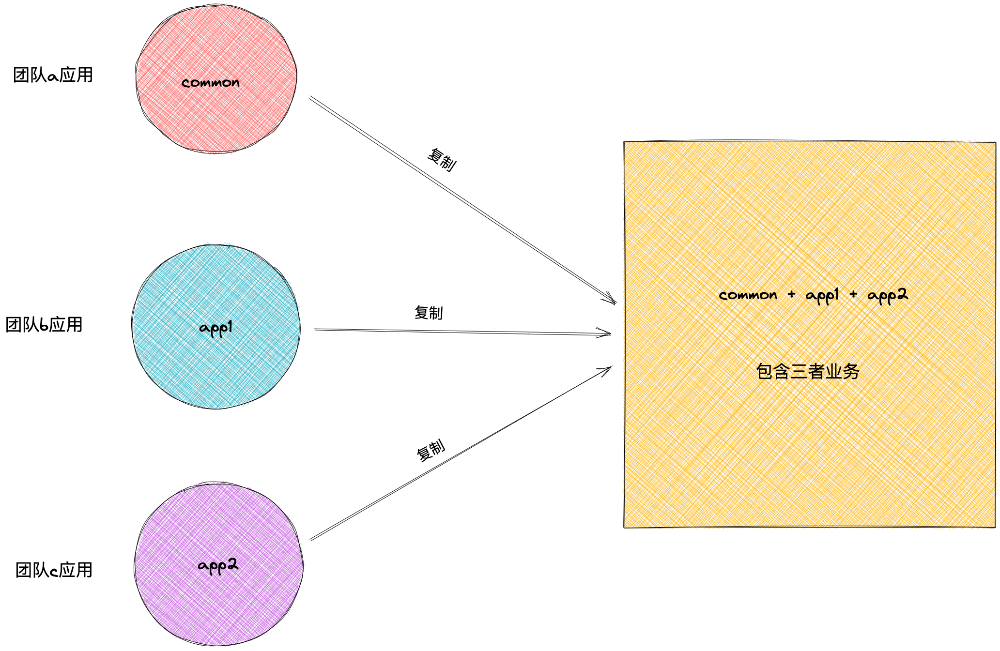
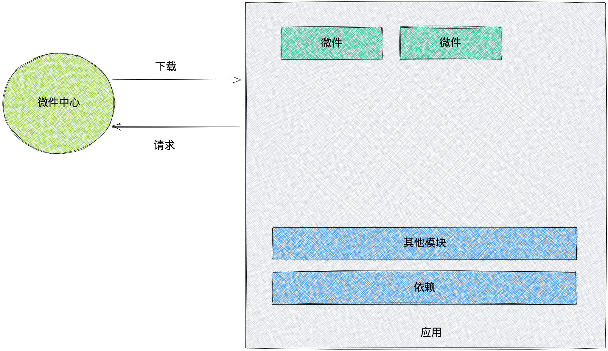

# 《前端架构：从入门到微前端》第九章读书笔记

大型组织的组织结构、软件架构在不断地发生变化。移动优先（Mobile First）、App平台（One App）、中台战略等，各种口号不断地被提出、修改和演进。同时，其业务也在不断地发展，由线下到线上、从无到有，这些进一步地导致组织的应用不断地膨胀，进一步地映射到软件架构上。

系统的组织在不断变化的同时，其设计和架构也在不断地调整。

而在组织结构变化的同时，架构也随着产生了一系列的变化，毕竟天下大势，分久必合，合久必分。与数据库的分库分表一样，既然一个组织的部门已经过于庞大，就进一步将它细化。同理，软件的不同部分又被拆分到不同的部门之下。随着不同部门的业务发展，技术栈也因此而越来越难以统一，出现了多样化。在走向多样化后，用户越来越厌倦一家公司的应用软件（App）分散在多个不同的应用上。应用的获客成本越来越高，应用又一次走向聚合。

在分离了前后端之后，拆分降低了系统的复杂度，并进一步提高了软件的开发效率。随着业务的不断扩张，需求也不断扩张，应用又开始变得臃肿。既然应用变大了，我们就继续往下拆分，拆分成更小的单位。

我们就可以通过微前端架构，来解决复杂的前端应用。

- 什么是微前端架构？它是如何形成的，以及有什么优缺点。
- 如何设计一个微前端架构的系统？
- 如何合理地拆分前端应用？

## 微前端
微前端是一种类似于微服务的架构，它将微服务的理念应用于浏览器端，即将单页面前端应用由单一的单体应用转变为把多个小型前端应用聚合为一的应用。各个前端应用还可以独立开发、独立部署。同时，它们也可以进行并行开发——这些组件可以通过NPM、Git TagGit或者Submodule来管理。

## 微前端架构
微前端的实现意味着对前端应用的拆分。拆分应用的目的并不只是为了在架构上好看，它还可以提升开发效率。比如10万行的代码拆解成10个项目，每个项目1万行代码，要独立维护每个项目就会容易得多。而我们只需要实现应用的自治，即实现应用的独立开发和独立部署，就可以在某种程度上实现微前端架构的目的。

1. 应用自治
1. 单一职责
1. 技术栈无关

### 应用自治
微前端架构，是多个应用组件的统一应用，这些应用可以交由多个团队来开发。要遵循统一的接口规范或者框架，以便于系统集成到一起，因此相互之间是不存在依赖关系的。我们可以在适当的时候，替换其中任意一个前端应用，而整体不受影响。这也意味着，我们可以使用各式各样的前端框架，而不会互相影响。

### 单一职责
与微服务类似的是，微前端架构理应满足单一职责的原则。然而，微前端架构要实现单一职责，并非那么容易。前端面向最终用户，前端需要保证用户体验的连续性。一旦在业务上关联密切，如B页面依赖A页面，A页面又在一定的程度上依赖B页面，拆分开来就没有那么容易。但是如果业务关联少，如一些关于“我们的联系方式”等的页面，使用不多，没有多少难度。因此，一旦面临用户体验的挑战，就要考虑选择其他方式。

### 技术栈无关
在后端微服务的架构中，技术栈无关是一个相当重要的特性。后端可以选用合适的语言和框架来开发最合适的服务，服务之间使用API进行通信即可。但是对于微前端架构来说，虽然拥有一系列的JavaScript语言，但是前端框架是有限的，即使在某个微前端架构里实现了框架无关，也并不是那么重要。框架之间的差距并不大，一个框架能做的事情，另一个框架也能做，这一点便不如后端。使用Java解决不了的人工智能部分，可以交给Python。

技术栈无关也是有一些问题的：

- 应用的拆分基础依赖于基础设施的构建，如果大量应用依赖于同一基础设施，那么维护就变成了一个挑战。
- 拆分的粒度越小，意味着架构变得越复杂、维护成本越高。
- 技术栈一旦多样化，便意味着技术栈是混乱的。

## 为什么需要微前端
虽然微前端不能为项目带来很高的效率，为什么还要使用微前端呢？

- 遗留系统迁移。
- 聚合前端应用。
- 热闹驱动开发。

### 遗留系统迁移

《前端架构：从入门到微前端》的作者黄峰达，在gitHub上发布了《微前端的那些事儿》。发现解决遗留系统是人们采用微前端方案的重要原因。

过去那些使用Backbone.js、Angular.js、Vue.js等框架所编写的单页面应用，已经在线上稳定地运行了，也没有新的功能。对于这样的应用来说，我们也没有理由浪费时间和精力重写旧的应用。而这些应用是使用旧的、不再使用的技术栈编写的，由于框架本身已经不更新（不增加新功能或者不再维护），因此应用可以称为遗留系统。既然应用可以使用，就不花太多的力气重写，而是直接整合到新的应用中去。

不重写原有系统，同时抽出人力来开发新的业务，这对业务人员来说，是一个相当有吸引力的特性，而且对技术人员来说，也是一件相当不错的事情。人生苦短，请尽量不重写。

### 后端解耦，前端聚合
后端采用微服务的注意原因，使用微服务进行解耦服务间的依赖。

后端在微服务的初期，使用不同的语言、技术栈来开发后台应用，这样做的一般都是中大型项目。对于小型项目来说，对于框架和语言的选型非常严格，如果确定了下来，基本就不会更改。

而在前端微服务化上，则恰恰与之相反，人们更想要的结果是聚合前端应用，尤其是那些To B（to Bussiness，面向企业）的应用。

一家大的商业公司，往往会提供一系列的应用，这些应用反应了这家公司的组织架构。当是对于用户来说，用户不想按照这么多的应用，希望能够只装一个应该就可以满足一切。最早之前是从移动端开始出现这种迹象的，目前的移动端已经存在了大量这种聚合的应用。并且这种趋势，从移动端蔓延至桌面端直至现在的web页面。而实现这种聚合的就是微前端架构。

### 热闹驱动开发
说白了，就是前端出现了一门新的比较火的技术，社区讨论比较多，比较热闹，开发者看到了，也想着自己去试试，驱使着去试试微前端。

## 微前端的技术方式
从微前端实践上，微前端架构可以采用以下几种方式实现:
- 路由分发式。通过HTTP服务器的反向代理功能，将请求路由到对应的应用上。
- 前端微服务化。在不同的框架之上设计通信和加载机制，以在一个页面内加载对应的应用。
- 微应用。通过软件工程的方式，在部署构建环境中，把多个独立的应用组合成一个单体应用。
- 微件化。开发一个新的构建系统，将部分业务功能构建成一个独立的chunk 代码，使用时只需要远程加载即可。
- 前端容器化。将iframe作为容器来容纳其他前端应用。
- 应用组件化。借助于Web Components技术，来构建跨框架的前端应用。

### 路由分发式
路由分发式微前端，即可通过路由将不同业务分发到不同的独立前端应用上。通常可以通过 nginx 上配置反向代理实现，或者通过应用框架自带的路由来处理。



路由分发式的架构是所有微前端里最容易的微前端方案。一个页面只有一个应用。

这种方式更像是多个前端应用的聚合，通过多个应用拼凑在一起，看起来是一个整体。但是在切换页面的时候，往往需求重新刷新页面、重新加载资源文件。

使用这种方式我们只需要关注应用间的数据传递方式。通过 localStorage、cookie、query 等方式。

### 前端微服务化
前端微服务化，是微服务在前端的实施，每个前端应用都完全独立、自主运行，最后通过模块化的方式组合出完整的前端应用。


采用这种方式意味着，一个页面上同时存在两个及以上的前端应用运行。

当我们加载页面，或者点击某个页面的路由时，会加载运行对应的应用。而原有的应用，仍然保持原先的运行状态。同时，这些应用可以使用不同的技术栈进行开发，比如 react、vue。。。

目前的主流框架，不管是react和vue的VirtualDOM 或是其他，最终都离不开基本的HTML元素DOM。

所以我们要做两件事：

1. 在页面对应的地方加入或者创建DOM。
1. 在用户操作时，加载对应的应用，并能卸载应用。

### 组合式集成：微应用化
微应用化，是指在开发时应用都是单一独立的形式存在，而在运行时，则通过构建系统合并这些应用，并组合成一个新的应用。



微应用化大都是以软件工程的方式来完成前端应用的开发的，因此又可以称之为组合式集成。

```
├── app1
├── app2
├── common
```

采用的架构往往是通过业务作为主目录，把应用的代码复制到对应的目录下，通过一些通用的共享模块进行使用。

微应用化算是一种微前端的实践，只是当我们使用微应用化时，意味着我们只能使用一种前端框架。

### 微件化
微件（Widget），是一段可以直接嵌入应用上运行的代码，它由开发人员预先编译好，在加载时不需要再做任何修改或编译。

微前端下的微件化则指的是，每个业务团队编写自己的业务代码，并将编译好的代码部署（上传或者放置）到指定的服务器上。在运行时，我们只需要加载相应的业务模块即可。在更新代码的时候，我们只需要更新相应的模块即可。



在非单页面应用时代，要实现微件化方案是一件特别容易的事。从远程加载JavaScript代码并在浏览器上执行，生成对应的组件嵌入页面。对于业务组件也是类似的，提前编写业务组件，当需要对应的组件时再响应和执行。在未来，我们也可以采用WebComponents技术来做这样的事情。

而在单页面时代，我们需要做以下这些事：
- 持有一个完整的框架运行时及编译环境。这用于保证微件能正常使用，即可调用框架API等。
- 性能受影响。应用由提前编译变成运行时才编译，会造成一些性能方面的影响——具体视组件的大小而定。
- 提前规划依赖。如果一个新的微件想使用新的依赖，需要从上游编译引入。

除此之外，我们还需要有一个能够支持上述系统的构建工具。
- 分包构建出来的独立代码，如webpack构建出来的chunk文件。
- 使用[DSL](https://zhuanlan.zhihu.com/p/107947462)的方式编写出来的组件。

### 前端容器 iframe
iframe作为一个非常“古老”的、人人都觉得普通的技术，却一直很管用。它能有效地将另一个网页/单页面应用嵌入当前页面中，两个页面间的CSS和JavaScript是相互隔离的——除去iframe父子通信部分的代码，它们之间的代码完全不会相互干扰。iframe便相当于创建了一个全新的独立的宿主环境，类似于沙箱隔离，它意味着前端应用之间可以相互独立运行。

当然采用iframe有几个重要的前提：
- 网站不需要[SEO](https://www.zhihu.com/question/19760381)支持。
- 拥有相应的应用管理机制。
    - 加载
    - 通讯

加载机制。在什么情况下，我们会去加载、卸载这些应用；在这个过程中，采用怎样的动画过渡，让用户看起来更加自然。

通讯机制。直接在每个应用中创建 postMessage 事件并监听，并不是一个友好的事情。其本身对于应用的侵入性太强，因此通过 iframeEl.contentWindow 去获取 iFrame 元素的 Window 对象是一个更简化的做法。随后，就需要定义一套通讯规范：事件名采用什么格式、什么时候开始监听事件等等。

如果我们做一个应用平台，会在系统中集成第三方系统，或多个不同部门团队下的系统，显然这仍然是一个非常靠谱的方案。此外，在上述几个微前端方案中，难免会存在一些难以解决的依赖问题，那么可以引入iframe来解决。


### 结合 Web Components 构建

真正在项目上使用Web Components技术，离现在的我们还有些距离，可是结合Web Components来构建前端应用，是一种面向未来演进的架构。或者说在未来，可以采用这种方式来构建应用。

> Web Components 是一套不同的技术，允许您创建可重用的定制元素（它们的功能封装在您的代码之外）并且在您的 Web 应用中使用它们

它主要由四项技术组件：
- Custom elements，允许开发者创建自定义的元素，诸如 。
- Shadow DOM，即影子 DOM，通常是将 Shadow DOM 附加到主文档 DOM 中，并可以控制其关联的功能。而这个 Shadow DOM 则是不能直接用其它主文档 DOM 来控制的。
- HTML templates，即 <template> 和 <slot> 元素，用于编写不在页面中显示的标记模板。
- HTML Imports，用于引入自定义组件。

每个组件由 link 标签引入：

<link rel="import" href="components/di-li.html">
<link rel="import" href="components/d-header.html">

随后，在各自的 HTML 文件里，创建相应的组件元素，编写相应的组件逻辑。一个典型的 Web Components 应用架构如下图所示：

而想要使用web components 实现微前端，非常复杂
- 重写现有的前端应用。是的，现在我们需要完成使用 Web Components 来完成整个系统的功能。
- 上下游生态系统不完善。缺乏相应的一些第三方控件支持，这也是为什么 jQuery 相当流行的原因。
- 系统架构复杂。当应用被拆分为一个又一个的组件时，组件间的通讯就成了一个特别大的麻烦。

## 微前端的业务划分方式
对于微前端如何划分边界也不是件容易的事，可以从以下几点考虑
- 按照业务拆分。
- 按照权限拆分。
- 按照变更的频率拆分。
- 按照组织结构拆分。
- 跟随后端微服务划分。

### 按照业务划分
在大型的前端应用里，往往包含了多个业务。这些业务往往在某种程度上存在一定的关联，但并非是强关联。

它们之间的关联可能并不是很紧密——对于前端应用来说，只需要一个系统内对象的ID，加上用户的Token，便能轻松地从一个系统跳转到另外一个系统中。这种业务本身的高度聚合，使得前端应用的划分也变得更加轻松。

如果业务间本身的耦合就比较严重，那么要从前端业务上分离它们，就不是很容易。

因此，对于由业务性质决定的应用，往往只能依据业务是否隔离来进行拆分。

### 按照权限进行划分
对于一个同时存在多种角色及多种不同权限的网站来说，最容易采用的方案就是通过权限来划分服务和应用。尤其这些权限在功能上是分开的，也就没有必要集中在一个前端应用中。

在一个带后台管理功能和前台展示页面的网站里，它们的功能有时候是绑定在一起的，如各种CMS、博客应用WordPress；而在一些大型系统中，它们往往又是独立的，有独立的入口来访问后台，有独立的入口来访问前台。多数时候，这取决于大部分用户是否同时拥有两种权限？如果只有管理员拥有后台权限，那么分开是一种更好的选择。因此，多数应用会在项目创建的初期将管理系统划分出去。

但是对于初始时期的管理来说，往往不会有这种划分方式。为了方便管理人员使用，它们需要结合在一起。可是随着后台管理的功能越来越多，应用会变得越来越臃肿。特别在单页面应用中，出于组件复用等目的，往往会将其设计在同一个前端工程中。

是否按照权限来划分应当取决于应用是否臃肿，或者是否正在变得臃肿，导致难以维护。还需要考虑是否为每种角色和权限划分出不同的前端应用。如果只有一种权限的功能比较高，而其他权限业务少，那么是否就只拆分成前台与后台两部分。

### 按照变更频率进行划分
在一个前端应用中，并非所有模块和业务代码都在进行频繁的修改，不同的模块可以有不同的变更频率，有些功能可能上线后，因为用户少，几乎不做变更；而有些功能是为了做而做，即证明自己有这个技术实力。除此之外有些功能，是用户最常用的，所以在不断的迭代优化中。因此可以通过变更频率进行划分。

不常用的功能，虽然变更少，但是数量多，可以拆分出去，也更容易维护。

经常变更的业务也可以进一步进行拆分——拆分成更多的前端应用或者服务。使用变更的频率进行拆分的前提是，我们使用数据统计来计算各部分的使用情况。对于一个大型的前端应用来说，这部分几乎是不存在问题的。

### 按照组织结构拆分
对于后端来说，按照组织结构拆分服务，几乎是一个默认的做法。团队之间使用API文档和契约，就可以轻松地进行协作。对于前端应用来说，同样可以采用这种方式来进行。

值得注意的是，它与业务划分方式稍有区别，一个团队可能维护多个业务。如果某些业务是由一个团队来维护的，那么在最开始的阶段，他们可能倾向于将这些业务放在同一应用中。然后，由于业务的增多或者业务变得复杂，则会进一步拆分成多个应用。


### 跟随后端微服务划分
微架构相关的实施，并不只有前端才有，往往是后端拥有相应的实施，前端项目才会进行进一步的拆分。而一旦后端拥有相关的服务，前端也可以追随后端的拆分方式。

然而，后端采用的拆分方式，并不都适合于前端应用——可能多数时候都不适合。如后端可能采取聚合关系来划分微服务，这时对于前端应用来说并没有多大的启发，但是有些时候还是可以直接采用一致的拆分模型。毕竟如果在后端服务上是解耦的，那么在前端业务上也存在一定解耦的可能性。

## 微前端的架构设计
有了微前端之后，不免产生一些疑问，我们真的需求微前端么？在考虑是否采用一种新的架构的时候，除了考虑它带来的好处，还要考量存在的大量风险和技术挑战。微前端，也是这样一个技术架构，和微服务一样，要进行实践，并做好一系列的技术储备。

### 构建基础设施

- 组件与模式库。在应用之间提供通用的UI组件、共享的业务组件，以及相应的通用函数功能模块，如日期转换等。
- 应用通信机制。设计应用间的通信机制，并提供相应的底层库支持。
- 数据共享机制。对于通用的数据，采取一定的策略来缓存数据，而不是每个应用单独获取自己的数据。
- 专用的构建系统（可选）。在某些微前端实现里，如微件化，构建系统用于构建出每个单独的应用，又可以构建出最后的整个应用。

## 微前端的架构模式

从微前端的应用上关系来说，可以分成两种模式：
- 基座模式（管理式）：通过一个主应用来管理其他应用，设计难度较小、实践简单，但是通用性低。
- 自组织模式：应用间是平等的模式。设计难度大，不方便实施，但是通用性高。

不论是那种方式，都需要提供一个查找应用的方式。
在微服务中有一个注册表模式，与微服务相似，前端也有一个应用注册表的服务，它可以是一个静态的文件，也可以是一个动态变更的配置，主要做以下这些事：
- 应用发现。让主应用可以寻找到其他应用。
- 应用注册。即提供新的微前端应用，向应用注册表注册的功能。
- 第三方应用注册。即让第三方应用接入系统中。
- 访问权限等相关配置

### 基座模式
在这种模式的微前端架构中，基座承担了微前端应用的基础与技术核心。基座模式，是由一个主应用和一系列业务子应用构成的系统，并由这个主应用来管理其他子应用，包括从子应用的生命周期管理到应用间的通信机制。

基座模式中的主应用，类似于API Gateway的概念，它作为系统的统一入口，负责将对应的请求指向对应的服务。子应用，则是负责各个子模块的业务实现。

要实现这种模式的微前端架构，只需要设计好对应的应用加载机制即可，因此在实施的时候也比较方便。

### 自组织模式
在采用基座模式时，用户要想访问A应用需要先加载主应用，然后才能加载A应用。采用自组织模式时，用户想要访问A应用则只访问A应用，不需要加载主应用，这也因此使它拥有了更高的自主性。

不过多数时候，我们并不需要自组织模式的微前端架构，因为它设计起来复杂、拥有大量的重复代码。

## 微前端设计理念
- 中心化：应用注册表。
- 标识化应用。
- 应用生命周期管理。
- 高内聚，低耦合

### 中心化：应用注册表
微服务从本质上说应该是去中心化的。但是，它又不能完全去中心化。因为对于一个微服务来说，它需要一个服务注册中心：服务提供方要注册通告服务地址，服务的调用方要能发现目标服务。

对于一个前端应用来说，我们也需要拥有一个应用注册表，它将拥有每个应用及对应的入口。

目前的大多少注册表是以路由的形式，当我们添加了一个新的应用时，就相当于在网页上添加了一个菜单链接，用户就能知道哪个页面是可以使用的，也就能访问到这个新的应用。

### 标识化应用
标识化应用是指，建立某种规则来区分不同的应用，类似于唯一标识符，即ID。我们需要这个ID来标识不同的应用，以便在安装和卸载的时候，能寻找到指定的应用。

### 应用生命周期管理
当用户单击某个链接时，相应的系统需要加载相应的应用，在这个过程中，还需要用加载动画来响应用户的行为，并创建应用所需要的DOM节点，将应用挂载到相应的DOM节点上，然后运行应用。当用户不需要这个应用时，我们可以选择卸载应用，或者继续保留应用。这几个步骤所做的事情，就体现了应用的生命周期。

前端微架构与后端微架构的最大不同之处，也在于此——生命周期。微前端应用作为一个客户端应用拥有自己的生命周期，生命周期包括如下3个部分：
1. 加载应用。
1. 运行应用。
1. 卸载应用。

微前端框架Single-SPA中设计了一个基本的生命周期（虽然它没有统一管理），其包含如下5种状态
- load：决定加载哪个应用，并绑定生命周期。
- bootstrap：获取静态资源。
- mount：安装应用，如创建DOM节点。
- unload：删除应用的生命周期。
- unmount：卸载应用，如删除DOM节点、取消事件绑定。

这部分的内容事实上就是微前端的一个难点所在，如何以合适的方式来加载应用呢？每个前端框架都各不相同，其所需要的加载方式也是不同的。当我们决定支持多个框架的时候，便需要在这一部分进行更细致的研究。

### 高内聚，低耦合
最后，在设计各个子应用及主应用的过程中，需要遵循高内聚、低耦合的原则。

高内聚，即模块内的关系，一个软件模块只由相关性很强的代码组成。设计的过程就是识别、度量模块内的联系，再将相关的行为聚集在一起，把不相关的行为放在别处。如果想要修改模块中某一部分的行为，只需要修改一处代码即可，而不需要修改多处。在实践的过程中，主要基于单一职责和关注点分离两个原则来实现。

低耦合，即模块间的关系。对于微架构系统来说，在服务之间、应用之间如果实现了松耦合，那么修改一个服务和应用就不需要修改另一个服务和应用。除了基座应用，每个应用都不应该关心协作应用的相关信息。

这两个词说起来很简单，但是真正在实现的过程中却相当麻烦。应用之间往往存在一定的依赖关系，要解耦这些依赖，就需要将数据独立出来，并使用通信的方式来传递状态。

[微前端架构详解(前端架构从入门到微前端)](https://jizhid.com/baike/iotbk/122106.html)
[前端架构——从入门到微前端](https://shlgdx.chineseall.cn/v3/book/read/iIgdg/PDF/1)


// TODO 提前规划依赖

// TODO shared

// 银联云 cookies 交互