# CSS SandBox

# 引言

本篇文章主要介绍的是关于`CSS Sandbox`的一些事情，为什么要介绍这个呢？在我们日常的开发中，样式问题其实一直是一个比较耗时的事情，一方面我们根据UI稿不断的去调整，另一方面随着项目越来越大可能哪一次开发就发现——诶，我的样式怎么不起作用了，亦或是怎么被另一个样式所覆盖了。原因可能有很多：

- 不规范的命名导致重复
- 为了简单，直接添加全局样式的修改
- 样式的不合理复用
- 多个项目合并时，每个子项目都有自己的独立样式和配置，可能在自己项目中不存在这样的问题，但是合并以后互相影响造成了样式污染
- 第三方框架引入
- ……

而`CSS Sandbox`正式为了隔离样式，从而解决样式污染的问题

# 应用场景

通过上述我们了解了样式污染产生的原因，从中我们也可以总结一下哪些场景时我们需要使用`CSS Sandbox`进行样式隔离呢

- 微前端场景下的父子以及子子应用
- 大型项目以及复杂项目的样式冲突
- 第三方框架以及自定义主题样式的覆盖
- ……

# 常见的解决方案

既然说了这么多样式污染产生的原因和应用场景，那我们该如何解决他们呢，目前有以下几种解决方案，其实解决的核心还是不变的——`使CSS选择器作用的Dom元素唯一`

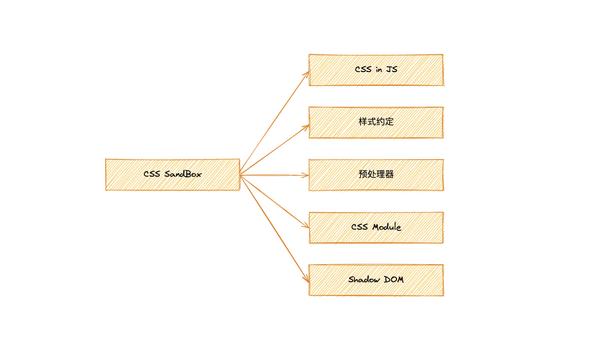

Tips：当我们在实际的开发中可以根据项目的实际情况进行选择

## CSS in JS

看名字是不是感觉很高级，直译下就是用JS去写CSS样式，而不是写在单独的样式文件里。例如：

```tsx
<p style='color:red'>css in js</p>
```

这和我们传统的开发思想很不一样，传统的开发原则是`关注点分离`，就比如我们常说的不写`行内样式`、`行内脚本`，即HTML、JS、CSS都写在对应的文件里。

关于CSS in JS不是一个新兴的技术，他的热度主要出现于一些Web框架的发展，比如说：React，它所支持的jsx语法，可以让我们在一个文件中同时写js、html和css，并且`组件`内部管理自己的样式、逻辑，组件化开发的思想深入人心。

```tsx
const style = {
	color: 'red'
}

ReactDOM.render(
  <p style={style}>
     css in js
  </h1>,
  document.getElementById('main')
);
```

每个组件的样式由自身的style决定，不依赖也不影响外部，从这一点来看确实实现了样式隔离的效果。

关于`Css in js`的库也有很多，比如说：

- [styled-components](https://styled-components.com/docs)
- [polished](https://polished.js.org/)
- ······

其中styled-components会动态生成一个选择器

```tsx
import styled from 'styled-components'

function App() {
  const Title = styled.h1`
    font-size: 1.5em;
    text-align: center;
    color: palevioletred;
  `;

  return (
    <div>
      <Title>Hello World, this is my first styled component!</Title>
    </div>
  );
}
```

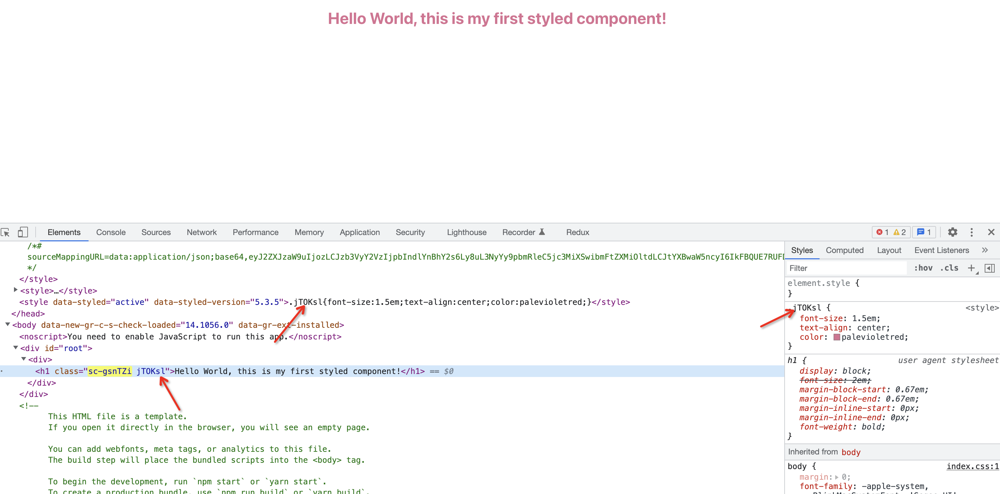

### 优缺点

| 优点 | • 没有作用域的样式污染问题（主要指的是通过写内行样式以及生成唯一的css选择器）
• 减少了无用样式的堆积，删除组件即删除对应的样式
• 通过导出定义的样式变量方便进行复用和重构 |
| --- | --- |
| 缺点 | • 内联样式不支持伪类和选择器等写法
• 代码的可读性比较差，违背了关注点分离的原则
• 运行时会消耗性能，动态生成css（我们在写css时其实还是js）
• 不能结合一些CSS预处理器，无法进行预编译 |

## 样式约定

通过约应用的命名前缀实现统一的开发和维护，比如说BEM的命名方式，通过对块、元素以及修饰符三者的命名来规范的描述一个组件

```tsx
.dropdown-menu__item-button--disabled
```

### 优缺点

| 优点 | • 样式隔离
• 语义化强，组件可读性高 |
| --- | --- |
| 缺点 | • 命名太长
• 依赖于开发者的命名 |

## 预处理器

通过css预处理器可以处理很多独特的语法格式，比如：

- 可嵌套性

```sass
body {
	with: 20px;
	p {
		color: red;
	}
}
```

- 父选择器

```sass
body {
	with: 20px;
	&:hover {
		with: 30px;
	}
}
```

- 属性继承

```less
.dev {
	width: 200px;
}

span {
	.dev
}
```

- ......

通过这些特殊的语法让css更容易解读和维护

一些常见的市场上的预处理器

- Sass
- Less
- Stylus
- PostCss
- ......

### 优缺点

| 优点 | • 可读性较好，方便理解和维护dom结构
• 利用嵌套等方式，也可以大幅度解决样式污染的问题 |
| --- | --- |
| 缺点 | •需要增加额外的包，借助相关编译工具 |

Tips：通常与类似于BEM的命名方式结合，可以达到提高开发效率，增强可读性以及复用的效果

## CSS Module

顾名思义就是将css进行模块化处理，编译好后可以避免样式被污染的问题，不过依赖于**Webpack**需要配置`css-loader`等打包工具，以下是我在`create-react-app`创建的项目中运行，由于其已经在webpack配置了`css-loader`，因此在此篇文章中不展示具体配置

index.ts文件

```tsx
import style from './style.module.css'

function App() {

  return (
    <div>
      <p className={style.text}>Css Module</p>
    </div>
  );
}

```

index.css文件

```sass
.text {
  color: red;
}

// 等同于
:local(.text) {
    color: blue;
}

// 还有一种全局模式，此时不会进行编译
:global(.text) {
    color: blue;
}
```

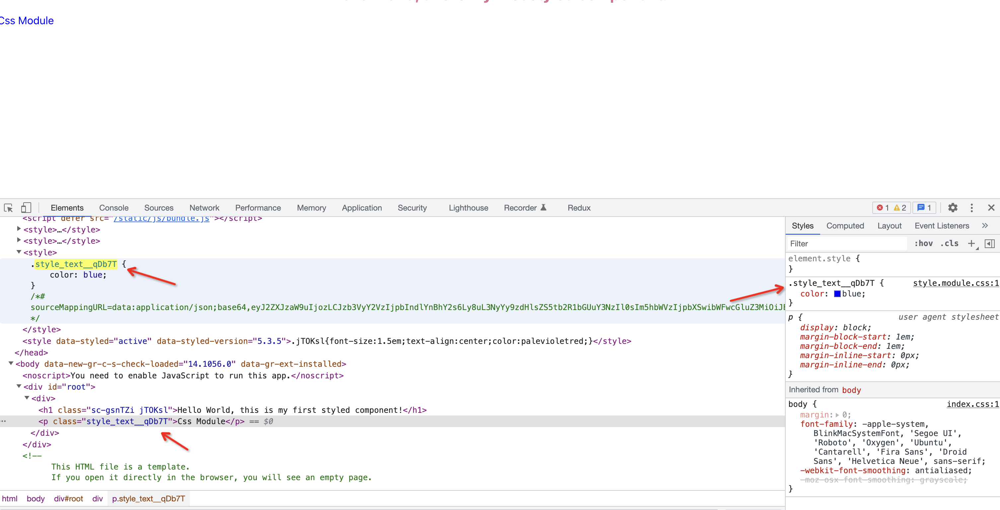

打包工具会同时把style.text以及text编译成独一无二的值

### 优缺点

| 优点 | • 学习成本较低，不依赖于人工约束
• 基本上能100%解决样式污染问题
• 方便实现模块的复用 |
| --- | --- |
| 缺点 | • 只能在构建时使用，依赖于css-loader等
• 可读性差，在控制台调试时出现hash值不方便调试 |

## Shadow DOM

它可以将一个隐藏、独立的DOM附加到一个元素上。当我们用Shadow DOM包裹一个元素后，其内样式不会对外部样式造成影响，外部样式也不会对其内部造成影响

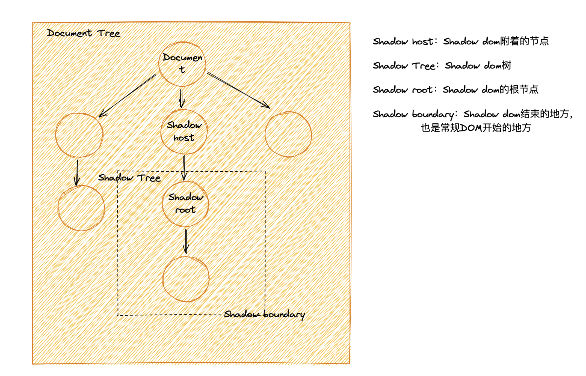

```tsx
// 创建一个shadow dom，我这里是通过ref去拿附着的节点，一般可以用document去拿
import './App.css'; // 定义了shadow-text的样式

function App() {
  const divRef = useRef(null)

  useEffect(() => {
    if(divRef?.current) {
      const { current } = divRef
      const shadow = current.attachShadow({mode: 'open'}); // mode用来控制能否用js获取shaow dom内的元素
      shadow.innerHTML = '<p className="shadow-text">Here is some new text</p>';
      console.log(current.shadowRoot)
    }
  }, [])

  return (
    <div>
      <div ref={divRef} className='shadow-host'></div>
    </div>
  );
}

```

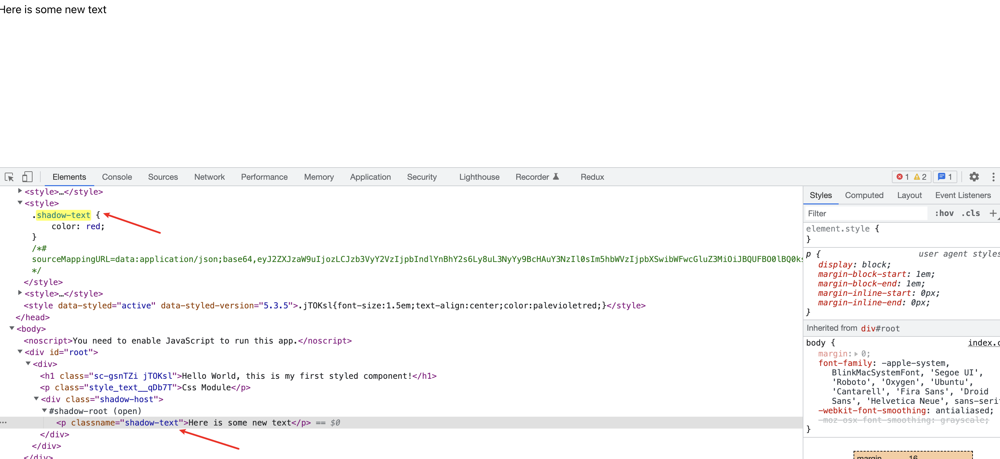

外部样式无法影响shadow dom内部的样式

我们再来看下shadow dom内部得样式会影响外部样式吗？

```tsx
function App() {
  useEffect(() => {
    if(divRef?.current) {
      const { current } = divRef
      const shadow = current.attachShadow({mode: 'open'});
      shadow.innerHTML = '<style>.shadow-h1 { color: red } </style><p class="shadow-h1">Here is some new text</p>';
      
    }
  }, [])

  return (
    <div>
      <Title>Hello World, this is my first styled component!</Title>
      <h1 className='shadow-h1'>lalla1</h1>
      <div ref={divRef} className='shadow-host'></div>
    </div>
  );
}
```

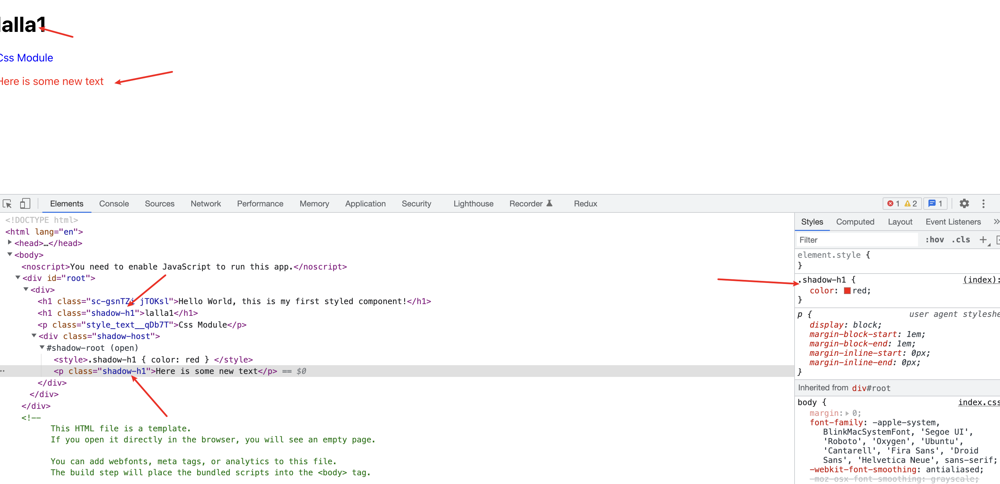

但是也有例外，除了`[:focus-within](https://developer.mozilla.org/zh-CN/docs/Web/CSS/:focus-within)`

```tsx
import { useEffect, useRef } from 'react'
import './App.css'; // .shadow-host:focus-within { background-color: yellow;}

function ShadowExample() {
  const divRef = useRef(null)

  useEffect(() => {
    if(divRef?.current) {
      const { current } = divRef
      const shadow = current.attachShadow({mode: 'open'});
      shadow.innerHTML = '<input class="shadow-h1"/>';
      
    }
  }, [])

  return (
    <div>
      <p>Css Module</p>
      <div ref={divRef} className='shadow-host'></div>
    </div>
  );
}

export default ShadowExample;
```


### 问题：

正由于`shadow dom`内的样式只会应用于内部，如果我们在shadow dom内部用了类似于`antd`的`Modal`这些创建于`document.body`下的弹窗或者其他组件时，无法应用于`antd`的样式，需要把`antd`的样式放到上一层中。

### 优缺点

| 优点 | • 不需要引入额外的包，浏览器原生支持
• 严格隔离 |
| --- | --- |
| 缺点 | • 在某些场景下可能出现样式失效的问题，如上问题中的shadow dom内创建了全局的Modal |

# 浅析QianKun中的CSS SandBox

上面我们讲解了一些实现样式隔离的基本方案，那作为一个比较成熟的微前端框架`QianKun`中又是怎么实现样式隔离方案的呢，以下的源码解析是在`v2.6.3`的版本上研究的，首先通过看文档可以发现


在QianKun中CSS SandBox有两种模式：

- `strictStyleIsolation`——严格沙箱模式
- `experimentalStyleIsolation`——实验性沙箱模式

## strictStyleIsolation

> 需要注意的是该方案不是一个无脑的解决方案，开启后需要进行一定的适配
> 

下面我们来详细介绍下该模式：

我们设置`strictStyleIsolation`为`true`时，`QianKun`采用的是`Shadow DOM`方案，核心就是为每个微应用包裹上一个Shadow DOM节点。接下来我们看下是怎么实现的

先来个流程图我们有个大致的概念：

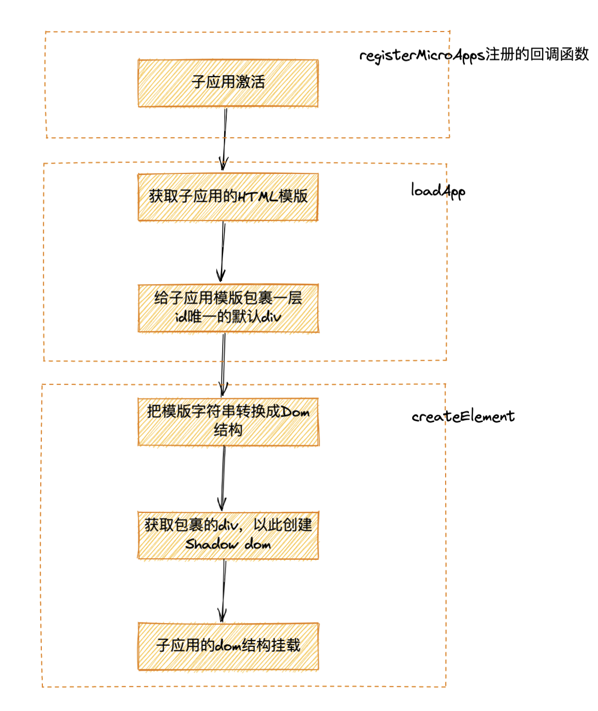

- **`registerMicroApps`：注册子应用，对未注册的应用进行记录，同时调用single-spa中的`registerApplication`进行注册**
- `loadApp`：加载子应用，初始化加载子应用的Dom结构，创建样式沙箱和JS沙箱等，同时返回不同阶段的生命周期
- `createElement`：样式沙箱的具体实现，主要分为两种`strictStyleIsolation`和`experimentalStyleIsolation`


### ****registerMicroApps：注册子应用****

```tsx
export function registerMicroApps<T extends ObjectType>(apps: Array<RegistrableApp<T>>,lifeCycles?: FrameworkLifeCycles<T>,) {
...
    registerApplication({
      name,
      app: async () => {
        ...
        // 加载微应用的具体方法，暴露bootstrap、mount、unmount等生命周期以及一些其他配置信息
        const { mount, ...otherMicroAppConfigs } = (
          await loadApp({ name, props, ...appConfig }, frameworkConfiguration, lifeCycles)
        )();
				...
      },
      // 子应用的激活条件
      activeWhen: activeRule
			...
    });
  });
}
```

调用single-spa的registerApplication对应用进行注册，并且在应用激活的时候调用app的回调，其中最主要的是`loadApp`加载微应用的具体方法

一些参数的说明：

- `apps`：微应用的注册信息
    
    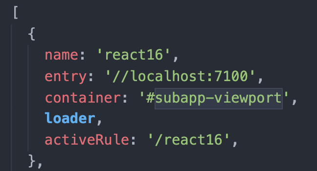
    
- `lifeCycles`：微应用的一些生命周期钩子
    
    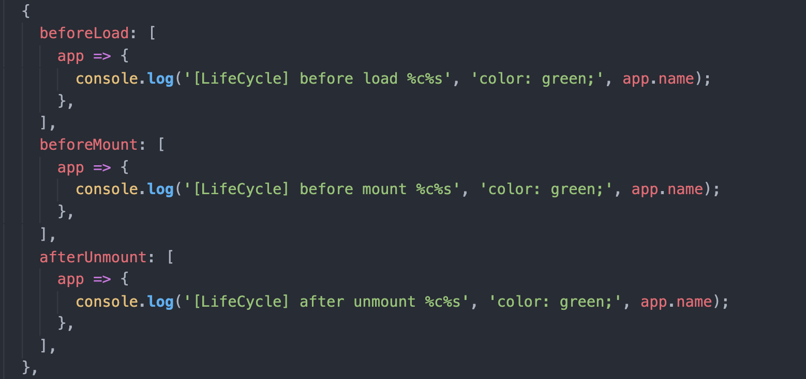
    

### loadApp：加载子应用

```tsx
function loadApp (app: LoadableApp<T>, configuration: FrameworkConfiguration = {},lifeCycles?: FrameworkLifeCycles<T>) {
...
/**
 * 将操作权交给主应用控制，返回结果涉及CSS SandBox和JS SandBox
 * template --template的为link替换为style注释script的HTML模版
 * execScripts --脚本执行器，让指定的脚本(scripts)在规定的上下文环境中执行，只做了解暂时不讲
 * assetPublicPath -- 静态资源地址，只做了解暂时不讲
 */
const { template, execScripts, assetPublicPath } = await importEntry(entry, importEntryOpts);

// 给子应用包裹一层div后的子应用html模版, 是模版字符串的形式
const appContent = getDefaultTplWrapper(appInstanceId)(template);

let initialAppWrapperElement: HTMLElement | null = createElement(
    appContent,
		// 是否开启了严格模式
    strictStyleIsolation,
		// 是否开启实验性的样式隔离
    scopedCSS,
		// 根据应用名生成的唯一值，唯一则为appName，不唯一则为appName_[count]为具体数量，重复会count++
    appInstanceId,
  );
...
// 下面还有一些生命周期的处理方法
}
```

Q1：到现在不知道还有没有人记得我们开启严格样式模式是需要做啥？

！！！把子应用的Dom结构放到Shadow dom中与主应用隔离，防止样式污染

Q2：那我们咋拿到子应用的dom结构呢？

没错就是通过`import-html-entry`库的`import-html-entry`方法，有兴趣给看下关于[import-html-entry解析](https://juejin.cn/post/6885212507837825038)

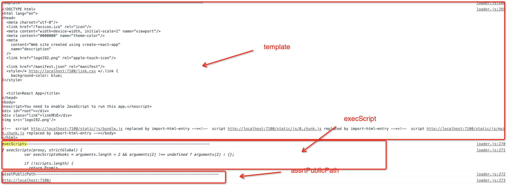

没错我们拿到了`template`、`execScripts`和`assetPublicPath`，这里我们不对后两个进行讲解，聚焦到`template`上：

对比下子应用原来的HTML结构


可以发现我们拿到的`template`是`link`标签变成`style`标签注释了`script`的HTML模版，其中就有我们需要的子应用的Dom结构。

拿到以后QianKun里又在`template`上包裹了一层div形成一个新的HTML结构的模版字符串，这是为什么呢？主要是为了在主应用中标识该节点下的内容为子应用，当然在后面我们也需要它进行特别的处理，这个后面讲到的时候再说。因此我们现在拿到的`appContent`长成这个样子：


这个div的id是唯一的哈！！！

那我们现在是不是已经做好了前期准备，现在我们需要进入最后一个步骤，把子应用的这个Dom结构挂载到一个shadow dom上，这就要用到`createElement`方法。

进入`createElement`方法前我们先来看下目前的参数值：

- appContent：包裹了一层id唯一的div，具体如上所示
- strictStyleIsolation：`true`
- scopedCSS：`false`
- appInstanceId：`react16`

### createElement：添加shadow dom

那我们现在如何去创建一个shadow dom，在前面关于shadow dom的讲解中我们知道，创建一个shadow dom我们需要两个东西：

一、挂载的dom节点

二、需要添加到shadow dom的内容

那我们从哪里去找呢，根据传进来的参数吧，我们无疑是要对`appContent`进行处理了，回顾下`appContent`有什么，包裹了一层div的子应用的HTML模版是吧，自然而然的我们就可以以外面的div为挂载的dom节点，拿子应用的HTML模版为需要添加到shadow dom的内容，即：

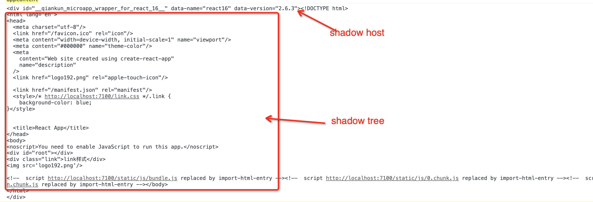

但是问题又来了， 目前的`appContent`是模版字符串嘞，我们咋办？这边QianKun的处理方案是：

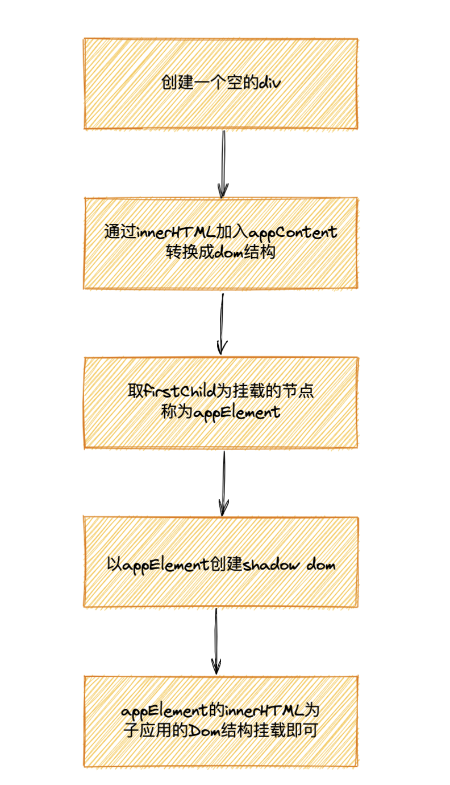

这只是个大致流程，下面让我们跟着这样的思想看下代码里处理：

```tsx
function createElement(appContent: string,strictStyleIsolation: boolean,scopedCSS: boolean,appInstanceId: string) {
...
const containerElement = document.createElement('div');
  containerElement.innerHTML = appContent;
  const appElement = containerElement.firstChild as HTMLElement;
	// 严格样式沙箱模式
  if (strictStyleIsolation) {
    if (!supportShadowDOM) {
      console.warn(
        '[qiankun]: As current browser not support shadow dom, your strictStyleIsolation configuration will be ignored!',
      );
    } else {
      const { innerHTML } = appElement;
      appElement.innerHTML = '';
      let shadow: ShadowRoot;

			// 创建shadow dom节点
      if (appElement.attachShadow) {
        shadow = appElement.attachShadow({ mode: 'open' });
      } else {
        // 兼容低版本
        shadow = (appElement as any).createShadowRoot();
      }
      shadow.innerHTML = innerHTML;
    }
  }
...
// 此处省略了开启experimentalStyleIsolation的处理方法
...
return appElement;
}
```

这里有个很有意思的是：

appContent以innerHTML变成dom结构后，HTML模版中的`<html>`、`<head>`以及`<body>`会被去掉

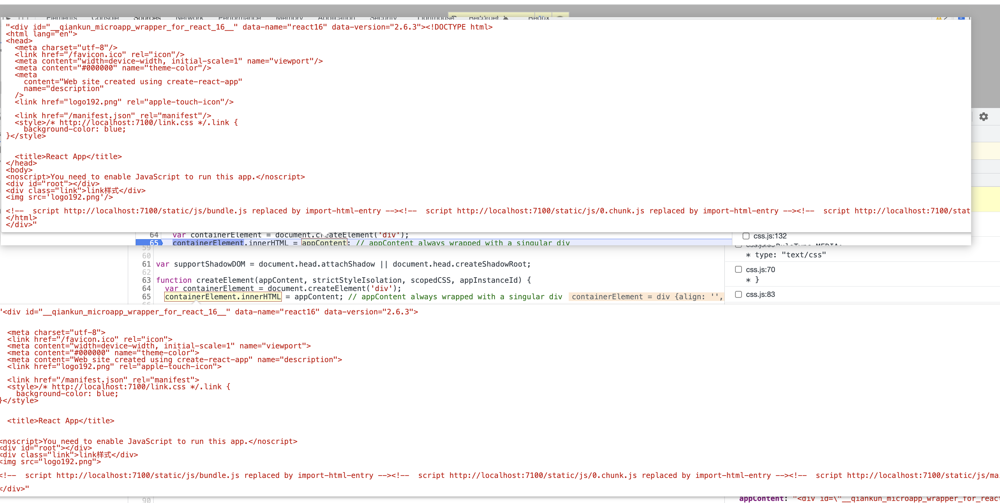

最后我们再来看下子应用挂载到主应用的Dom结构：


笔者在实践的过程中也遇到了一些问题：

1、微应用中使用相对路径引入图片出现加载资源404的问题，这边笔者没有进行过多的尝试可以参考下官方的：[https://qiankun.umijs.org/zh/faq#为什么微应用加载的资源会-404](https://qiankun.umijs.org/zh/faq#%E4%B8%BA%E4%BB%80%E4%B9%88%E5%BE%AE%E5%BA%94%E7%94%A8%E5%8A%A0%E8%BD%BD%E7%9A%84%E8%B5%84%E6%BA%90%E4%BC%9A-404)

2、还有一个问题就是react中动态打开Modal失效的问题，原因可以看下‣，大概看了下和React的事件机制有关，即使是设置弹窗默认开启，也会出现之前上面提到的，样式丢失的问题

！！！看下一个之前简单回顾下吧—————————————————————————————————

## experimentalStyleIsolation

我们设置`experimentalStyleIsolation`为`true`时，`QianKun`采用的是`Runtime css transformer` 动态加载/卸载样式表方案，为子应用的样式表增加一个特殊的选择器从而限定影响范围，类似以下结构：

```tsx
// 假设应用名是 react16
<style>
.app-main {
  font-size: 14px;
}
</style>

<style>
div[data-qiankun="react16"] .app-main {
  font-size: 14px;
}
<style>
```

先来通过流程图了解下大致流程


### createElement：给最外层增加data-qiankun属性，并且获取所有style标签

```tsx
function createElement(appContent: string, strictStyleIsolation: boolean, scopedCSS: boolean,appInstanceId: string) {
...
if (scopedCSS) {
		// 给最外层设置data-qiankun的属性
    const attr = appElement.getAttribute(css.QiankunCSSRewriteAttr);
    if (!attr) {
      appElement.setAttribute(css.QiankunCSSRewriteAttr, appInstanceId);
    }
		// 获取所有的style标签,进行遍历
    const styleNodes = appElement.querySelectorAll('style') || [];
    forEach(styleNodes, (stylesheetElement: HTMLStyleElement) => {
      css.process(appElement!, stylesheetElement, appInstanceId);
    });
  }
...
}

export const QiankunCSSRewriteAttr = 'data-qiankun';
```

我们来看下设置完属性后的属性后的appElement


styleNodes


### css.process详细处理

```tsx
/**
* 实例化ScopedCSS
* 生成根元素属性选择器[data-qiankun="应用名"]前缀
*/
export const process = (
  appWrapper: HTMLElement,
  stylesheetElement: HTMLStyleElement | HTMLLinkElement,
  appName: string,
): void => {
  // 实例化ScopedCSS
  if (!processor) {
    processor = new ScopedCSS();
  }
	...
	// 一些空值的处理
  const mountDOM = appWrapper;
  if (!mountDOM) {
    return;
  }

  const tag = (mountDOM.tagName || '').toLowerCase();

  if (tag && stylesheetElement.tagName === 'STYLE') {
		// 生成前缀，根元素标签名[data-qiankun="应用名"]
    const prefix = `${tag}[${QiankunCSSRewriteAttr}="${appName}"]`;
    processor.process(stylesheetElement, prefix);
  }
};
```

- prefix：
    
    `div[data-qiankun="react16"]`
    
- stylesheetElement：


### 进入processor.process看看对它进行了什么操作

```tsx
// 重写样式选择器以及对于空的style节点设置MutationObserver监听，原因可能存在动态增加样式的情况
process(styleNode: HTMLStyleElement, prefix: string = '') {
		// 当style标签有内容时进行操作
    if (styleNode.textContent !== '') {
			// styleNode.textContent为style标签内的内容
      const textNode = document.createTextNode(styleNode.textContent || '');
			// swapNode为创建的空的style标签
      this.swapNode.appendChild(textNode);
			// 获取样式表
      const sheet = this.swapNode.sheet as any;
			// 从样式表获取cssRules该值是标准的，把样式规则从伪数组转化成数组
      const rules = arrayify<CSSRule>(sheet?.cssRules ?? []);
			// 通过遍历和正则重写每个选择器的前缀
      const css = this.rewrite(rules, prefix);
			// 将处理后的重写后的css放入原来的styleNode中
      styleNode.textContent = css;
      // 清理工具人swapNode
      this.swapNode.removeChild(textNode);
      return;
    }

		//对空的样式节点进行监听，可能存在动态插入的问题
    const mutator = new MutationObserver((mutations) => {
      for (let i = 0; i < mutations.length; i += 1) {
				// mutation为变更的每个记录MutationRecord
        const mutation = mutations[i];

				// 判断该节点是否应处理过
        if (ScopedCSS.ModifiedTag in styleNode) {
          return;
        }

        if (mutation.type === 'childList') {
          const sheet = styleNode.sheet as any;
          const rules = arrayify<CSSRule>(sheet?.cssRules ?? []);
          const css = this.rewrite(rules, prefix);

          styleNode.textContent = css;
          // 增加处理节点的标识
          (styleNode as any)[ScopedCSS.ModifiedTag] = true;
        }
      }
    });

    // 监听当前的style标签，当styleNode为空的时候，以及变更的时候，比如引入的antd样式文件
    mutator.observe(styleNode, { childList: true });
  }
```

Q1：为什么在`style`标签有内容的时候使用`this.swapNode`这个工具人，而在监听的时候不使用？

还记得我们是需要干什么吗？

改写`style`标签内的样式规则

因此这里就通过`style.sheet.cssRules`方式去获取style标签里的每一条规则进行重写，我们来看下`sheet`样式表的数据结构


通过这个结构我们其实下一步想要做的事情很清楚了

就是重写每一条`cssRules`并且通过字符串拼接赋值给`style`标签


但是我们得注意两点：

- 选择器不同我们的处理方式也不同
- 对选择器的匹配规则的处理

### 让我们看看rewrite具体进行了什么操作，这里主要分为两块：

- 一对选择器的类型进行判断
    
    [CSSRule.type](https://developer.mozilla.org/en-US/docs/Web/API/CSSRule/type)
    

```tsx
private rewrite(rules: CSSRule[], prefix: string = '') {
    let css = '';

    rules.forEach((rule) => {
      switch (rule.type) {
				// 普通选择器类型
        case RuleType.STYLE:
          css += this.ruleStyle(rule as CSSStyleRule, prefix);
          break;
				// @media选择器类型
        case RuleType.MEDIA:
          css += this.ruleMedia(rule as CSSMediaRule, prefix);
          break;
				// @supports选择器类型
        case RuleType.SUPPORTS:
          css += this.ruleSupport(rule as CSSSupportsRule, prefix);
          break;
        default:
          css += `${rule.cssText}`;
          break;
      }
    });

    return css;
  }
```

- 二是进行正则替换

特殊的

```tsx
// 处理类似于@media screen and (min-width: 900px) {}
private ruleMedia(rule: CSSMediaRule, prefix: string) {
  const css = this.rewrite(arrayify(rule.cssRules), prefix);
  return `@media ${rule.conditionText} {${css}}`;
}

// 处理类似于@supports (display: grid) {}
private ruleSupport(rule: CSSSupportsRule, prefix: string) {
  const css = this.rewrite(arrayify(rule.cssRules), prefix);
  return `@supports ${rule.conditionText} {${css}}`;
}
```

普通的

```tsx
// prefix为"div[data-qiankun="react16"]"
private ruleStyle(rule: CSSStyleRule, prefix: string) {
		// 根选择器，比如body、html以及:root
    const rootSelectorRE = /((?:[^\w\-.#]|^)(body|html|:root))/gm;
		// 根组合选择器，类似于 html body{...}
    const rootCombinationRE = /(html[^\w{[]+)/gm;

		// 获取选择器
    const selector = rule.selectorText.trim();

		// 获取样式文本，比如"html { font-family: sans-serif; line-height: 1.15; text-size-adjust: 100%; -webkit-tap-highlight-color: rgba(0, 0, 0, 0); }"
    let { cssText } = rule;
	   // 对根选择器(body、html、:root)进行判断，替换成prefix
    if (selector === 'html' || selector === 'body' || selector === ':root') {
      return cssText.replace(rootSelectorRE, prefix);
    }

    // 对于根组合选择器进行匹配
    if (rootCombinationRE.test(rule.selectorText)) {
      const siblingSelectorRE = /(html[^\w{]+)(\+|~)/gm;
			// 对于非标准的兄弟选择器转换时进行忽略，置空处理
      if (!siblingSelectorRE.test(rule.selectorText)) {
        cssText = cssText.replace(rootCombinationRE, '');
      }
    }

    // 普通选择器匹配
    cssText = cssText.replace(/^[\s\S]+{/, (selectors) =>
			// selectors为类似于.link{
      selectors.replace(/(^|,\n?)([^,]+)/g, (item, p, s) => {
				// 处理类似于div,body,span { ... }，含有根元素的
        if (rootSelectorRE.test(item)) {
          return item.replace(rootSelectorRE, (m) => {
            const whitePrevChars = [',', '('];
						// 将其中的根元素替换为前缀保留,或者（
            if (m && whitePrevChars.includes(m[0])) {
              return `${m[0]}${prefix}`;
            }
						// 直接把根元素替换成前缀
            return prefix;
          });
        }

        return `${p}${prefix} ${s.replace(/^ */, '')}`;
      }),
    );

    return cssText;
  }
```

### 动态添加样式的思考🤔

那么通过JS动态添加的`style`、`link`或者`script`标签都是不是也需要运行在相应的`CSS`或者`JS`沙箱中呢，添加这些标签的常见方法无疑是`createElement`、`appendChild`和`insertBefore`，那其实我们只要对他们设置监听就可以了

`dynamicAppend`就是用来解决上面的问题的，它暴露了两个方法

- patchStrictSandbox：QianKun JS沙箱模式的多例模式


**patchStrictSandbox**

```tsx
export function patchStrictSandbox(
  appName: string,
	// 返回包裹子应用的那一块Dom结构
  appWrapperGetter: () => HTMLElement | ShadowRoot,
  proxy: Window,
  mounting = true,
  scopedCSS = false,
  excludeAssetFilter?: CallableFunction,
){
  ...
let containerConfig = proxyAttachContainerConfigMap.get(proxy);
  if (!containerConfig) {
    containerConfig = {
      appName,
      proxy,
      appWrapperGetter,
      dynamicStyleSheetElements: [],
      strictGlobal: true,
      excludeAssetFilter,
      scopedCSS,
    };
		// 建立了代理对象和子应用配置信息Map关系
    proxyAttachContainerConfigMap.set(proxy, containerConfig);
  }

	// 重写Document.prototype.createElement
  const unpatchDocumentCreate = patchDocumentCreateElement();

	// 重写appendChild、insertBefore
  const unpatchDynamicAppendPrototypeFunctions = patchHTMLDynamicAppendPrototypeFunctions(
    (element) => elementAttachContainerConfigMap.has(element),
    (element) => elementAttachContainerConfigMap.get(element)!,
  );
  ...
}
```

- 扩展`Document.prototype.createElement`
- 扩展`appendChild`、`insertBefore`

**patchDocumentCreateElement**

```tsx
function patchDocumentCreateElement() {
	// 记录createElement是否被重写
  const docCreateElementFnBeforeOverwrite = docCreatePatchedMap.get(document.createElement);

  if (!docCreateElementFnBeforeOverwrite) {
    const rawDocumentCreateElement = document.createElement;
		// 重写Document.prototype.createElement
    Document.prototype.createElement = function createElement<K extends keyof HTMLElementTagNameMap>(
      this: Document,
      tagName: K,
      options?: ElementCreationOptions,
    ): HTMLElement {
      const element = rawDocumentCreateElement.call(this, tagName, options);
			// 判断创建的是否为style、link和script标签
      if (isHijackingTag(tagName)) {
        const { window: currentRunningSandboxProxy } = getCurrentRunningApp() || {};
        if (currentRunningSandboxProxy) {
					// 获取子应用的配置信息
          const proxyContainerConfig = proxyAttachContainerConfigMap.get(currentRunningSandboxProxy);
          if (proxyContainerConfig) {
            // 建立新元素element和子应用配置的对应关系
            elementAttachContainerConfigMap.set(element, proxyContainerConfig);
          }
        }
      }

      return element;
    };

    if (document.hasOwnProperty('createElement')) {
			// 重写
      document.createElement = Document.prototype.createElement;
    }

    docCreatePatchedMap.set(Document.prototype.createElement, rawDocumentCreateElement);
  }
}

function isHijackingTag(tagName?: string) {
  return (
    tagName?.toUpperCase() === LINK_TAG_NAME ||
    tagName?.toUpperCase() === STYLE_TAG_NAME ||
    tagName?.toUpperCase() === SCRIPT_TAG_NAME
  );
}
```

- 重写`document.createElement`
- 建立新元素element和子应用配置的对应关系`elementAttachContainerConfigMap`

**patchHTMLDynamicAppendPrototypeFunctions**

```tsx
export function patchHTMLDynamicAppendPrototypeFunctions(
  isInvokedByMicroApp: (element: HTMLElement) => boolean,
  containerConfigGetter: (element: HTMLElement) => ContainerConfig,
) {
  // 当appendChild和insertBefore没有被重写的时候
  if (
    HTMLHeadElement.prototype.appendChild === rawHeadAppendChild &&
    HTMLBodyElement.prototype.appendChild === rawBodyAppendChild &&
    HTMLHeadElement.prototype.insertBefore === rawHeadInsertBefore
  ) {
    HTMLHeadElement.prototype.appendChild = getOverwrittenAppendChildOrInsertBefore({
      rawDOMAppendOrInsertBefore: rawHeadAppendChild,
      containerConfigGetter,
      isInvokedByMicroApp,
    }) as typeof rawHeadAppendChild;
    HTMLBodyElement.prototype.appendChild = getOverwrittenAppendChildOrInsertBefore({
      rawDOMAppendOrInsertBefore: rawBodyAppendChild,
      containerConfigGetter,
      isInvokedByMicroApp,
    }) as typeof rawBodyAppendChild;

    HTMLHeadElement.prototype.insertBefore = getOverwrittenAppendChildOrInsertBefore({
      rawDOMAppendOrInsertBefore: rawHeadInsertBefore as any,
      containerConfigGetter,
      isInvokedByMicroApp,
    }) as typeof rawHeadInsertBefore;
  }}
```

- 当appendChild、appendChild和insertBefore没有被重写的时候进行重写

getOverwrittenAppendChildOrInsertBefore

```tsx
function getOverwrittenAppendChildOrInsertBefore(opts: {
  rawDOMAppendOrInsertBefore: <T extends Node>(newChild: T, refChild?: Node | null) => T;
  isInvokedByMicroApp: (element: HTMLElement) => boolean;
  containerConfigGetter: (element: HTMLElement) => ContainerConfig;
}) {
  return function appendChildOrInsertBefore<T extends Node>(
    this: HTMLHeadElement | HTMLBodyElement,
    newChild: T,
    refChild: Node | null = null,
  ) {
    let element = newChild as any;
    const { rawDOMAppendOrInsertBefore, isInvokedByMicroApp, containerConfigGetter } = opts;
    // 当不是style、link或者是script标签的时候或者在元素的创建找不到对应的子应用配置信息时，走原生的方法
    if (!isHijackingTag(element.tagName) || !isInvokedByMicroApp(element)) {
      return rawDOMAppendOrInsertBefore.call(this, element, refChild) as T;
    }

    if (element.tagName) {
      // 获取当前子应用的配置信息
      const containerConfig = containerConfigGetter(element);
      const {
        appName,
        appWrapperGetter,
        proxy,
        strictGlobal,
        dynamicStyleSheetElements,
        scopedCSS,
        excludeAssetFilter,
      } = containerConfig;

      switch (element.tagName) {
        case LINK_TAG_NAME:
        case STYLE_TAG_NAME: {
          let stylesheetElement: HTMLLinkElement | HTMLStyleElement = newChild as any;
          const { href } = stylesheetElement as HTMLLinkElement;
          // 配置项不需要被劫持的资源
          if (excludeAssetFilter && href && excludeAssetFilter(href)) {
            return rawDOMAppendOrInsertBefore.call(this, element, refChild) as T;
          }

          // 挂载的dom结构，即子应用的dom结构
          const mountDOM = appWrapperGetter();

          // 如果开启了实验性的样式沙箱模式
          if (scopedCSS) {
            // exclude link elements like <link rel="icon" href="favicon.ico">
            const linkElementUsingStylesheet =
              element.tagName?.toUpperCase() === LINK_TAG_NAME &&
              (element as HTMLLinkElement).rel === 'stylesheet' &&
              (element as HTMLLinkElement).href;
            // 对于link标签进行样式资源下载，并进行样式的重写
            if (linkElementUsingStylesheet) {
              const fetch =
                typeof frameworkConfiguration.fetch === 'function'
                  ? frameworkConfiguration.fetch
                  : frameworkConfiguration.fetch?.fn;
              stylesheetElement = convertLinkAsStyle(
                element,
                (styleElement) => css.process(mountDOM, styleElement, appName),
                fetch,
              );
              dynamicLinkAttachedInlineStyleMap.set(element, stylesheetElement);
            } else {
              css.process(mountDOM, stylesheetElement, appName);
            }
          }

          // 重写以后的style标签
          dynamicStyleSheetElements.push(stylesheetElement);
          const referenceNode = mountDOM.contains(refChild) ? refChild : null;
          return rawDOMAppendOrInsertBefore.call(mountDOM, stylesheetElement, referenceNode);
        }
	...
}
```

- patchLooseSandbox：QianKun JS沙箱模式的单例模式和快照模式下


```tsx
export function patchLooseSandbox(
  appName: string,
  appWrapperGetter: () => HTMLElement | ShadowRoot,
  proxy: Window,
  mounting = true,
  scopedCSS = false,
  excludeAssetFilter?: CallableFunction,
): Freer {
  let dynamicStyleSheetElements: Array<HTMLLinkElement | HTMLStyleElement> = [];

  const unpatchDynamicAppendPrototypeFunctions = patchHTMLDynamicAppendPrototypeFunctions(
    // 判断当前微应用是否运行
		() => checkActivityFunctions(window.location).some((name) => name === appName),
    // 返回微应用的配置信息
		() => ({
      appName,
      appWrapperGetter,
      proxy,
      strictGlobal: false,
      scopedCSS,
      dynamicStyleSheetElements,
      excludeAssetFilter,
    }),
  );
}
```

由于是单例模式修改的还是全局的window去掉了对`document.createElement`的重写，不需要建立微应用和新建元素的一一对应