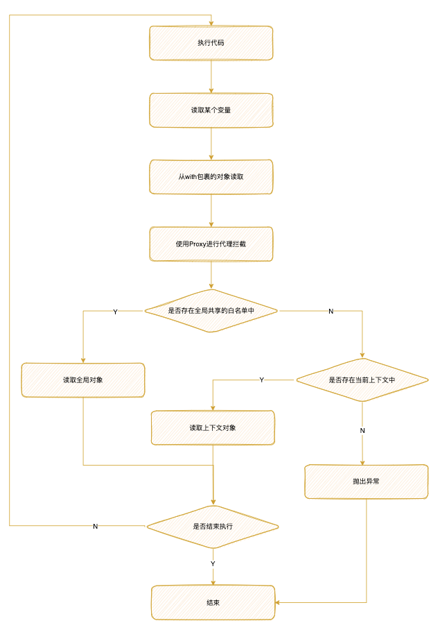
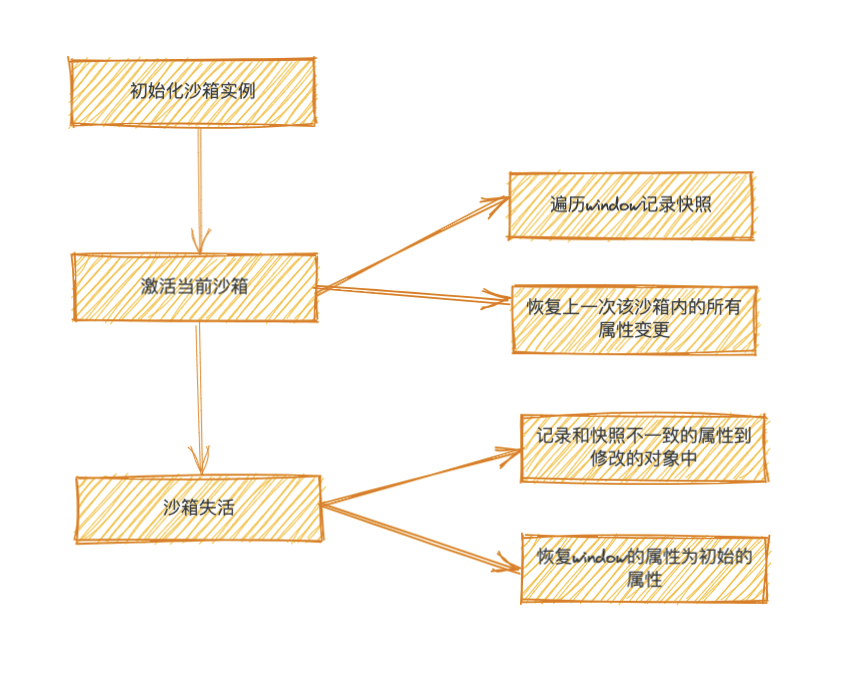
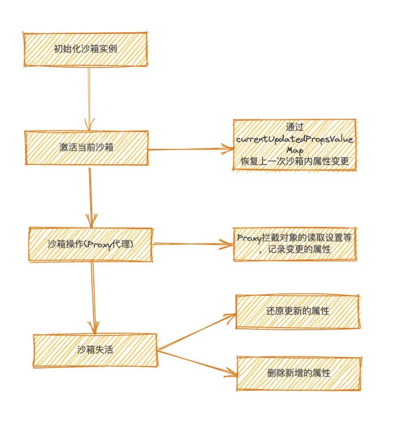
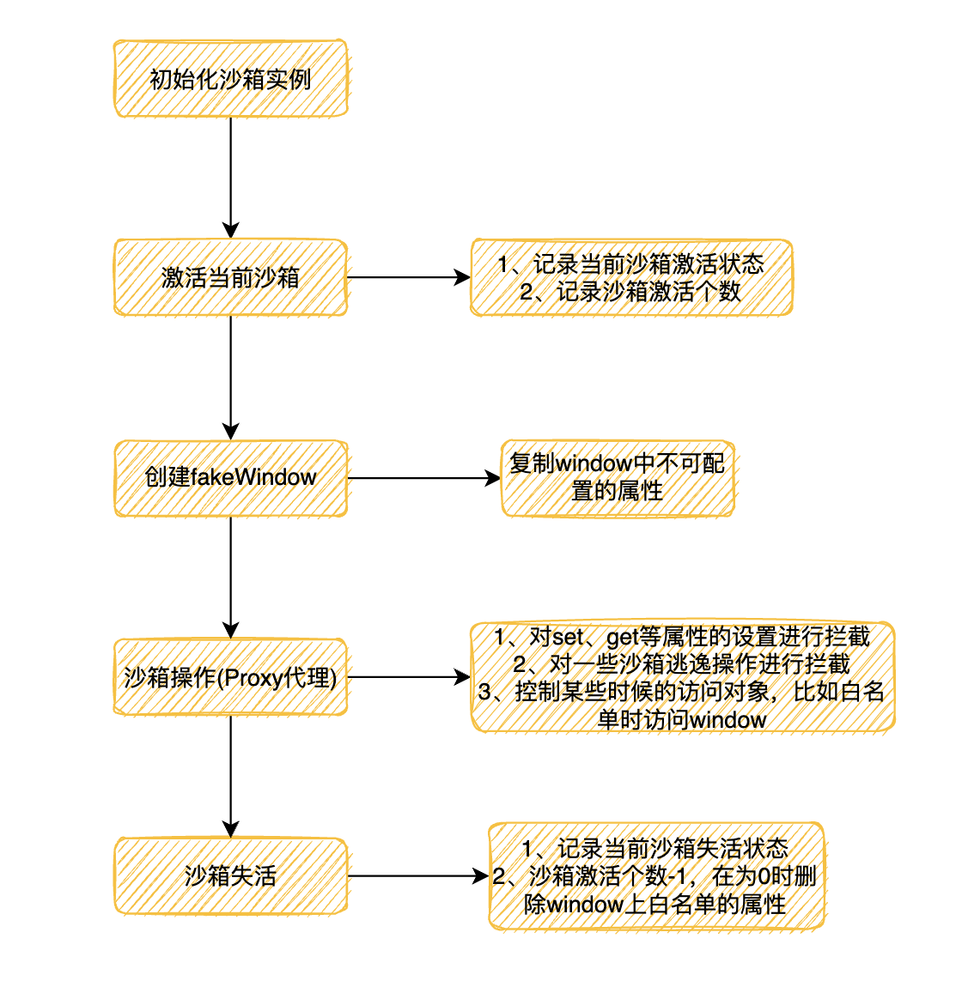

# JS SandBox

## 什么是沙箱

沙箱即 `SandBox`，它是一种安全机制，用于严格控制访问资源。通过在程序中创建一个独立的运行环境，把一些`来源不可信`、`具有破坏力`或者又是`无法判定的恶意程序`使其在该环境下运行，隔离了对外部程序的影响，这样即使发生了错误或者安全问题都不会影响到外面。

我们根据实现的方案不同， `SandBox`可以分为两种模式：

- 单实例模式：全局只存在一个实例，直接代理原生的`window`对象，记录每个沙箱内`window`对象上的增删改等操作，激活某个沙箱时恢复上一次失活时的状态，失活时恢复原来`window`的状态。
- 多实例模式：代理一个全新的`window`对象，所有的更改基于这个全新的对象，多个实例之间互不影响。

## 沙箱的应用场景

基于上面👆对沙箱的介绍，简而言之我们最终的目的还是为了保障程序的正常运行，通过隔离的手段避免错误、异常或者恶意代码的影响，在我们日常开发或者接触中，也有很多这样的场景，以下列举几个：

- **微前端**：微前端场景下，各个子应用被集成到一个运行时，避免每个子应用互相影响，导致的一些如全局污染的问题，下面👇会以`QianKun`为例进行详细的讲述
- **JSONP**：当运行通过 `<script>`标签的url返回的JS代码时，为了规避一定程度上的风险可能需要在沙箱中执行
- **在线编辑器**：在某些场景下我们会提供一个编辑器或者类似的可输入界面需要用户自主的编辑代码，然后去执行它，比如：`CodeSandBox`对于用户输入的不确定代码为了防止污染最好是在沙箱中执行

我们把它们进行抽象的归类，大概可以分为以下三类：

- **执行时**：执行不确定、不可信的JS代码
- **引入时**：为引入的`JS`代码提供隔离环境
- **访问时**：执行代码对全局对象的访问和修改进行限制

## JS沙箱的常见解决方案

在实现`JS`沙箱问题之前我们需要有两点需要注意：

- 构建独立的上下文环境
- 模拟浏览器的原生对象

基于这两点，目前给出以下几种方案：

### with

`with`语句将改变`作用域`，会让内部的访问优先从传入的对象上查找。怎么理解呢，我们来看一下这一段代码：

```jsx
const obj = {
  a: 1
}
const obj2 = {
  b: 2
}
const a = 9

const fun = (obj) => {
  with(obj) { // 相当于{}内访问的变量都会从obj上查找
    console.log(a)
    a = 3
  }
}

fun(obj) // 1
console.log(obj) // { a: 3 } 
```

在当前的内部环境中找不到某个变量时，会沿着作用作用域链一层层向上查找，如果找不到就拋出`ReferenceError`异常。我们看下下面这个例子：

```jsx
const obj = {
  a: 1
}
const obj2 = {
  b: 2
}
const b = 9

const fun = (obj) => {
  with(obj) {
    console.log(a, b)
  }
}

fun(obj) // 1 9
fun(obj2) // ReferenceError: a is not defined
```

虽然`with`实现了在当前上下文中查找变量的效果，但是仍然存在一下问题：

- 找不到时会沿着作用域链往上查找
- 当修改存在的变量时，会同步修改外层的变量

除此之外`with`还有其他的一些弊端👉[详细了解](https://developer.mozilla.org/zh-CN/docs/Web/JavaScript/Reference/Statements/with)

### ES6 proxy

为了解决`with`存在的问题，我们来了解下`proxy`方法。`proxy`用于创建一个对象的代理，从而实现对基本操作的拦截以及自定义。

**基本语法**

```jsx
/**
* @param {*} target - 使用Proxy包装的目标对象
* @param {*} handler - 通常为一个函数，函数的各个属性分别定义了执行各个操作时的代理行为
*/
const p = new Proxy(target, handler)
```

👉[详细了解](https://developer.mozilla.org/zh-CN/docs/Web/JavaScript/Reference/Global_Objects/Proxy)

**改进流程**



**code实现**

```jsx
const obj = {
  a: 1
}
const obj2 = {
  b: 2
}
let b = 3

// 用with改变作用域
const withedCode = (code) => {
  // return (obj)  => {
  //   with(ctxProxy(obj)){
  //     eval(code)
  //   }
  // }
  code = `with(obj) { ${ code } }`
  const fun = new Function('obj', code)
  return fun
}

// 执行代码
const code = 'console.log(b)'

// 白名单
const whiteList = ['console', 'b']

// // 访问拦截
const ctxProxy = (ctx) => new Proxy(ctx, {
  has: (target, prop) => { // 当返回false的时候会沿着作用域向上查找，true为在当前作用域进行查找
    if(whiteList.includes(prop)) { 
      return false
    }
    if(!target.hasOwnProperty) { 
      throw new Error(`can not find - ${prop}!`)
    }
    return true
  },
})

withedCode(code)(ctxProxy(obj2)) // 3
```

思考🤔：为啥需要把`console`添加到`whiteList`中？

Tips：该案例在浏览器中运行正常，在`node`中运行可能出现问题，原因是使用了`new Function`,创建的函数只能在全局作用域中运行，而在`node`中顶级的作用域不是全局作用域，当前全局声明的变量是在当前模块的作用域里的。详细查看：[Function](https://developer.mozilla.org/zh-CN/docs/Web/JavaScript/Reference/Global_Objects/Function)

这样一个简单的沙箱是不是完成了，那我们现在会不会想这样一个问题？

解决完对象的访问控制，我们现在解决第二个问题如何模拟浏览器的全局对象———`iframe`

还有人不清楚为啥需要模拟浏览器的对象吗🤔？

- 一些全局对象方法的使用比如上面的`console.log`等
- 获取全局对象中的一些初始变量

### with + proxy + iframe

我们把原生浏览器的对象取出来

```jsx
// 设置src为about:blank，保证是同域的，因为只有同域的才能取出contentWindow
const iframe = document.createElement('iframe', { src:'about:blank' })
document.body.append(iframe)
const globalObj = iframe.contentWindow
```

创建一个全局代理对象的类

```jsx
class GlobalProxy{
    constructor(shareState) {
        return new Proxy(globalObj, {
            has: (target, prop) => {
                if(shareState.includes(prop)) {
                    return false
                }
                if(!target.hasOwnProperty(prop)) {
                    throw new Error(`can not find - ${prop}!`)
                }
                return true
            }
        })
    }
}
```

实际效果：

```jsx
// 创建共享白名单
const shareState = []

// 创建一个沙箱实例
const sandBox = new GlobalProxy(shareState)

const withedCode = (code) => {
    code = `with(obj) { ${ code } }`
    const fun = new Function('obj', code)
    return fun
}

sandBox.window.abc = 123

// 执行代码
const code = 'console.log(window.abc)'

withedCode(code)(sandBox)
console.log(window.abc)

//------console------
// 123
// undefined
```

### Web Workers

通过创建一个独立的浏览器线程来达到隔离的目的，但是具有一定的局限性

- 不能直接操作`DOM`节点
- 不能使用window`window`对象的默认方法和属性

......

原因在于`workers`运行在另一个全局上下文中，不同于当前的window。

因此适用的场景大概类似于一些表达式的计算等。

**通信方式**

workers和主线程之间通过消息机制进行数据传递

- `postMessage`——发送消息
- `onmessage`——处理消息

我们来简单看个例子：

```jsx
// index.js
window.app = '我是元数据'
const myWorker = new Worker('worker.js')

myWorker.onmessage = (oEvent) => {
  console.log('Worker said : ' + oEvent.data)
}
myWorker.postMessage('我是主线程！')

// worker.js
postMessage('我是子线程！');
onmessage = function (oEvent) {
  postMessage("Hi " + oEvent.data);
	console.log('window', window)
	console.log('DOM', document)
}

// -------------console-------------
// Worker said : 我是子线程！
// Worker said : Hi 我是主线程！
// Uncaught ReferenceError: window is not defined
```

👉[详细了解](https://developer.mozilla.org/zh-CN/docs/Web/API/Web_Workers_API/Using_web_workers)

## 沙箱逃逸

沙箱逃逸即通过各种手段摆脱沙箱的束缚，访问沙箱外的全局变量甚至是篡改它们，实现一个沙箱还需要预防这些情况的发生。

### Symbol.unscopables

`Symbol.unscopables`设置了`true`会对`with`进行无视，沿着作用域进行向上查找。

举个例子：

```jsx
const obj = {
    a: 1
}

let a = 10

obj[Symbol.unscopables] = {
    a: true
}

with(obj) {
    console.log(a) // 10
}
```

改进上述`with + proxy + iframe`中的全局代理对象的类

```jsx
class GlobalProxy{
    constructor(shareState) {
        return new Proxy(globalObj, {
            has: (target, prop) => {
                if(shareState.includes(prop)) {
                    return false
                }
                if(!target.hasOwnProperty(prop)) {
                    throw new Error(`can not find - ${prop}!`)
                }
                return true
            },
            get: (target, prop) => {
								// 处理Symbol.unscopables逃逸
                if(prop === Symbol.unscopables) return undefined
                return target[prop]
            }
        })
    }
}
```

### window.parent

可以在沙箱的执行上下文中通过该方法拿到外层的全局对象

```tsx
// 设置src为about:blank，保证是同域的，因为只有同域的才能取出contentWindow
const iframe = document.createElement('iframe', { src:'about:blank' })
document.body.append(iframe)
const globalObj = iframe.contentWindow

class GlobalProxy{
    constructor(shareState) {
        return new Proxy(globalObj, {
            has: (target, prop) => {
                if(shareState.includes(prop)) {
                    return false
                }
                if(!target.hasOwnProperty(prop)) {
                    throw new Error(`can not find - ${prop}!`)
                }
                return true
            },
            get: (target, prop) => {
                // 处理Symbol.unscopables逃逸
                if(prop === Symbol.unscopables) return undefined
                
                return target[prop]
            }
        })
    }
}

// 创建共享白名单
const shareState = []

// 创建一个沙箱实例
const sandBox = new GlobalProxy(shareState)

const withedCode = (code) => {
    code = `with(obj) { ${ code } }`
    const fun = new Function('obj', code)
    return fun
}

sandBox.window.abc = 123
sandBox.aaa = 789

sandBox[Symbol.unscopables] = {
    aaa: true
}

var aaa = 123

// 执行代码
const code = 'console.log(parent.test = 789)'

withedCode(code)(sandBox)
console.log(window.test) // 789
```

改进方案

```glsl
get: (target, prop) => {
    // 处理Symbol.unscopables逃逸
    if(prop === Symbol.unscopables) return undefined
		// 阻止window.parent逃逸
    if(prop === 'parent') {
        return target
    }
    return target[prop]
}
```

### 原型链逃逸

通过某个变量的原型链向上查找，从而达到篡改全局对象的目的

```tsx
const code = `([]).constructor.prototype.toString = () => {
    return 'Escape!'
}`

console.log([1,2,3].toString()) // Escape!
```

……

## 未来可尝试的新方案

### ShadowRealms

      它是未来JS的一项功能，目前已经进入stage-3。通过它我们可以创建一个单独的全局上下文环境来执行JS。

关于ShadowRealms的更多详情：

- [https://fjolt.com/article/javascript-shadowrealms](https://fjolt.com/article/javascript-shadowrealms)
- [https://github.com/tc39/proposal-shadowrealm#APITypeScriptFormat](https://github.com/tc39/proposal-shadowrealm#APITypeScriptFormat)

### ****Portals****

      类似于iframe的新标签。

关于portals的更多详情

- [https://github.com/WICG/portals/](https://github.com/WICG/portals/)

## 探究QianKun中的沙箱

      有了上面的知识储备以后，让我们来看看`QianKun`中的沙箱是怎么样子的，以下只讲述一些关键代码，源码地址：[https://github.com/umijs/qiankun/tree/master/src/sandbox](https://github.com/umijs/qiankun/tree/master/src/sandbox)，版本为`v2.6.3`

我们进入index文件看下

```jsx
// 是否支持Proxy代理
if (window.Proxy) {
  sandbox = useLooseSandbox ? new LegacySandbox(appName, globalContext) : new ProxySandbox(appName, globalContext);
} else {
  sandbox = new SnapshotSandbox(appName);
}
```

我们可以看到`QianKun`里的沙箱主要分为三种

- `LegacySandbox`：单实例代理沙箱，简单来讲就是只存在一个window实例，所有的操作都是对这一个实例的操作
- `ProxySandbox`：多实例代理沙箱，通过对window的拷贝建立多个副本，在沙箱中对建立的副本进行操作
- `SnapshotSandbox`：快照沙箱，基于 diff 方式实现的沙箱，用于不支持 Proxy 的低版本浏览器

### SnapshotSandbox

我们先来看下SnapshotSandbox这个沙箱，源码：

```tsx
// 遍历对象
function iter(obj: typeof window, callbackFn: (prop: any) => void) {
  for (const prop in obj) {
    if (obj.hasOwnProperty(prop) || prop === 'clearInterval') {
      callbackFn(prop);
    }
  }
}

/**
 * 基于 diff 方式实现的沙箱，用于不支持 Proxy 的低版本浏览器
 */
export default class SnapshotSandbox implements SandBox {
  proxy: WindowProxy;

  name: string;

  type: SandBoxType;

  sandboxRunning = true;

  private windowSnapshot!: Window;

  private modifyPropsMap: Record<any, any> = {};

  constructor(name: string) {
    this.name = name;
    this.proxy = window;
    this.type = SandBoxType.Snapshot;
  }

  active() {
    // 记录当前快照
    this.windowSnapshot = {} as Window;
    iter(window, (prop) => {
      this.windowSnapshot[prop] = window[prop];
    });

    // 恢复之前的变更
    Object.keys(this.modifyPropsMap).forEach((p: any) => {
      window[p] = this.modifyPropsMap[p];
    });

    this.sandboxRunning = true;
  }

  inactive() {
    this.modifyPropsMap = {};

    iter(window, (prop) => {
      if (window[prop] !== this.windowSnapshot[prop]) {
        // 记录变更，恢复环境
        this.modifyPropsMap[prop] = window[prop];
        window[prop] = this.windowSnapshot[prop];
      }
    });

    if (process.env.NODE_ENV === 'development') {
      console.info(`[qiankun:sandbox] ${this.name} origin window restore...`, Object.keys(this.modifyPropsMap));
    }

    this.sandboxRunning = false;
  }
}
```

结合流程图



分块解读一下，这里我们把它分成两块来看

**激活时**

```jsx
active() {
  this.windowSnapshot = {} as Window;
  iter(window, (prop) => { // 通过遍历的方式记录当前window的状态，即window的当前快照
    this.windowSnapshot[prop] = window[prop];
  });

  Object.keys(this.modifyPropsMap).forEach((p: any) => { // 
    window[p] = this.modifyPropsMap[p]; // 通过遍历恢复上一次失活时的变更
  });

  this.sandboxRunning = true;
}
```

**失活时**

```jsx
inactive() {
  this.modifyPropsMap = {}; 

  iter(window, (prop) => { // 遍历window上的属性
    if (window[prop] !== this.windowSnapshot[prop]) {
      this.modifyPropsMap[prop] = window[prop]; // 记录和快照不一致的属性到修改的对象中
      window[prop] = this.windowSnapshot[prop]; // 恢复window的属性为初始的属性
    }
  });

  this.sandboxRunning = false;
}
```

`SnapshotSandbox`比较简单，由于不支持代理，所有的更改都在`window`上，只是在激活沙箱的时候保存一个`window`的初始快照，并在期间对变更的属性进行记录，失活时恢复初始的`window`，但是会造成全局`window`的污染

### LegacySandbox

我们来看下LegacySandbox沙箱，该沙箱基于Proxy实现的

**流程图**



源码部分

```tsx
// 判断对象上的某个属性描述是否是可更改或者是可删除的
function isPropConfigurable(target: WindowProxy, prop: PropertyKey) {
  const descriptor = Object.getOwnPropertyDescriptor(target, prop);
  return descriptor ? descriptor.configurable : true;
}

/**
 * 基于 Proxy 实现的沙箱
 * TODO: 为了兼容性 singular 模式下依旧使用该沙箱，等新沙箱稳定之后再切换
 */
export default class LegacySandbox implements SandBox {
  /** 沙箱期间新增的全局变量 */
  private addedPropsMapInSandbox = new Map<PropertyKey, any>();

  /** 沙箱期间更新的全局变量 */
  private modifiedPropsOriginalValueMapInSandbox = new Map<PropertyKey, any>();

  /** 持续记录更新的(新增和修改的)全局变量的 map，用于在任意时刻做 snapshot */
  private currentUpdatedPropsValueMap = new Map<PropertyKey, any>();

  name: string;

  proxy: WindowProxy;

  globalContext: typeof window;

  type: SandBoxType;

  sandboxRunning = true;

  latestSetProp: PropertyKey | null = null;

	// 设置globalContext对象上的属性
  private setWindowProp(prop: PropertyKey, value: any, toDelete?: boolean) {
    if (value === undefined && toDelete) {
      delete (this.globalContext as any)[prop];
    } else if (isPropConfigurable(this.globalContext, prop) && typeof prop !== 'symbol') {
      Object.defineProperty(this.globalContext, prop, { writable: true, configurable: true });
      (this.globalContext as any)[prop] = value;
    }
  }

  active() {
    if (!this.sandboxRunning) {
      this.currentUpdatedPropsValueMap.forEach((v, p) => this.setWindowProp(p, v));
    }

    this.sandboxRunning = true;
  }

  inactive() {
    this.modifiedPropsOriginalValueMapInSandbox.forEach((v, p) => this.setWindowProp(p, v));
    this.addedPropsMapInSandbox.forEach((_, p) => this.setWindowProp(p, undefined, true));

    this.sandboxRunning = false;
  }

  constructor(name: string, globalContext = window) {
    this.name = name;
    this.globalContext = globalContext;
    this.type = SandBoxType.LegacyProxy;
    const { addedPropsMapInSandbox, modifiedPropsOriginalValueMapInSandbox, currentUpdatedPropsValueMap } = this;

    const rawWindow = globalContext;
    const fakeWindow = Object.create(null) as Window;

    const setTrap = (p: PropertyKey, value: any, originalValue: any, sync2Window = true) => {
      if (this.sandboxRunning) {
        if (!rawWindow.hasOwnProperty(p)) {
          addedPropsMapInSandbox.set(p, value);
        } else if (!modifiedPropsOriginalValueMapInSandbox.has(p)) {
          // 如果当前 window 对象存在该属性，且 record map 中未记录过，则记录该属性初始值
          modifiedPropsOriginalValueMapInSandbox.set(p, originalValue);
        }

        currentUpdatedPropsValueMap.set(p, value);

        if (sync2Window) {
          // 必须重新设置 window 对象保证下次 get 时能拿到已更新的数据
          (rawWindow as any)[p] = value;
        }

        this.latestSetProp = p;

        return true;
      }

      // 在 strict-mode 下，Proxy 的 handler.set 返回 false 会抛出 TypeError，在沙箱卸载的情况下应该忽略错误
      return true;
    };

    const proxy = new Proxy(fakeWindow, {
      set: (_: Window, p: PropertyKey, value: any): boolean => {
        const originalValue = (rawWindow as any)[p];
        return setTrap(p, value, originalValue, true);
      },

      get(_: Window, p: PropertyKey): any {
        // avoid who using window.window or window.self to escape the sandbox environment to touch the really window
        // or use window.top to check if an iframe context
        // see https://github.com/eligrey/FileSaver.js/blob/master/src/FileSaver.js#L13
        if (p === 'top' || p === 'parent' || p === 'window' || p === 'self') {
          return proxy;
        }

        const value = (rawWindow as any)[p];
        return getTargetValue(rawWindow, value);
      },

      // trap in operator
      // see https://github.com/styled-components/styled-components/blob/master/packages/styled-components/src/constants.js#L12
      has(_: Window, p: string | number | symbol): boolean {
        return p in rawWindow;
      },

      getOwnPropertyDescriptor(_: Window, p: PropertyKey): PropertyDescriptor | undefined {
        const descriptor = Object.getOwnPropertyDescriptor(rawWindow, p);
        // A property cannot be reported as non-configurable, if it does not exists as an own property of the target object
        if (descriptor && !descriptor.configurable) {
          descriptor.configurable = true;
        }
        return descriptor;
      },

      defineProperty(_: Window, p: string | symbol, attributes: PropertyDescriptor): boolean {
        const originalValue = (rawWindow as any)[p];
        const done = Reflect.defineProperty(rawWindow, p, attributes);
        const value = (rawWindow as any)[p];
        setTrap(p, value, originalValue, false);

        return done;
      },
    });

    this.proxy = proxy;
  }
}
```

同样的我们来分块解读一下

这里有三个主要的变量，我们需要先知道下

```tsx
/** 沙箱期间新增的全局变量 */
private addedPropsMapInSandbox = new Map<PropertyKey, any>();

/** 沙箱期间更新的全局变量,记录的是激活子应用时window上的初始值 */
private modifiedPropsOriginalValueMapInSandbox = new Map<PropertyKey, any>();

/** 持续记录更新的(新增和修改的)全局变量的 map，用于在任意时刻做 snapshot */
private currentUpdatedPropsValueMap = new Map<PropertyKey, any>();

// 白名单，是微应用之间全局共享的变量
const variableWhiteList: PropertyKey[] = [
  'System',
  '__cjsWrapper',
  ...variableWhiteListInDev,
]
```

**激活时**

```jsx
active() {
  if (!this.sandboxRunning) {
		// 把上一次沙箱激活时的变更，设置到window上
    this.currentUpdatedPropsValueMap.forEach((v, p) => this.setWindowProp(p, v));
  }
  this.sandboxRunning = true;
}
```

**失活时**

```jsx
inactive() {
  ...
	// 通过遍历还原window上的初始值
  this.modifiedPropsOriginalValueMapInSandbox.forEach((v, p) => this.setWindowProp(p, v));
	// 通过对新增属的遍历，去除window上新增的属性
	this.addedPropsMapInSandbox.forEach((_, p) => this.setWindowProp(p, undefined, true));
  this.sandboxRunning = false;
}
```

**Proxy代理**

```tsx
const proxy = new Proxy(fakeWindow, {
	set: (_: Window, p: PropertyKey, value: any): boolean => {
	  const originalValue = (rawWindow as any)[p];
		// 把变更的属性同步到addedPropsMapInSandbox、modifiedPropsOriginalValueMapInSandbox以及currentUpdatedPropsValueMap
	  return setTrap(p, value, originalValue, true);
	},
	
	get(_: Window, p: PropertyKey): any {
		// 防止通过使用top、parent、window、self访问外层真实的环境
	  if (p === 'top' || p === 'parent' || p === 'window' || p === 'self') {
	    return proxy;
	  }
	
	  const value = (rawWindow as any)[p];
		//一些异常处理获取value的真实值，主要处理了window.console、window.atob这类API在微应用中调用时会抛出 Illegal invocation异常的问题
	  return getTargetValue(rawWindow, value);
	},
	
	has(_: Window, p: string | number | symbol): boolean {
		// 访问的属性是否在rawWindow上，不在返回false沿着作用域向上查找
	  return p in rawWindow;
	},
	
	// 拦截对象的Object.getOwnPropertyDescriptor()操作
	getOwnPropertyDescriptor(_: Window, p: PropertyKey): PropertyDescriptor | undefined {
	  const descriptor = Object.getOwnPropertyDescriptor(rawWindow, p);
	  // A property cannot be reported as non-configurable, if it does not exists as an own property of the target object
	  if (descriptor && !descriptor.configurable) {
	    descriptor.configurable = true;
	  }
	  return descriptor;
	},
	
	// 拦截对象的Object.defineProperty()操作
	defineProperty(_: Window, p: string | symbol, attributes: PropertyDescriptor): boolean {
	  const originalValue = (rawWindow as any)[p];
	  const done = Reflect.defineProperty(rawWindow, p, attributes);
	  const value = (rawWindow as any)[p];
	  setTrap(p, value, originalValue, false); // 变更属性记录
	
	  return done;
	},
});

const setTrap = (p: PropertyKey, value: any, originalValue: any, sync2Window = true) => {
  if (this.sandboxRunning) {
		// 判断是否为rawWindow自己的属性
    if (!rawWindow.hasOwnProperty(p)) {
			// 新增的属性存入addedPropsMapInSandbox
      addedPropsMapInSandbox.set(p, value);
    } else if (!modifiedPropsOriginalValueMapInSandbox.has(p)) {
      // 修改的属性把初始值存入modifiedPropsOriginalValueMapInSandbox中
      modifiedPropsOriginalValueMapInSandbox.set(p, originalValue);
    }
		
		// 当前数据的所有变更记录在currentUpdatedPropsValueMap中
    currentUpdatedPropsValueMap.set(p, value);

    if (sync2Window) {
      // 必须重新设置 window 对象保证下次 get 时能拿到已更新的数据
      (rawWindow as any)[p] = value;
    }

    this.latestSetProp = p;

    return true;
  }

  // 在 strict-mode 下，Proxy 的 handler.set 返回 false 会抛出 TypeError，在沙箱卸载的情况下应该忽略错误
  return true;
}
```

仍然是操作window对象，会造成全局window的污染，但是不需要记录window的初始快照，也不需要对window进行自身属性的整个遍历相比于diff快照效率会高点，性能会好点。

### ProxySandbox

接下来我们来看下ProxySandbox这个沙箱，该沙箱通过创建一个window的副本`fakeWindow`实现每个`ProxySandbox`实例之间属性互不影响

流程图



首先我们需要创建一个window副本`fakeWindow`和`propertiesWithGetter`,后一个是用来记录有`getter`且不可配置的Map对象，大概包括`window`、`document`、`location`、`top`等，这些属性拷贝以后会成为非法调用的对象，所以我们需要从`globalContext`上进行访问，具体实现参考`proxy`中的get部分

```tsx
function createFakeWindow(globalContext: Window) {
	// 记录 window 对象上的 get 属性，原生的有：window、document、location、top
  const propertiesWithGetter = new Map<PropertyKey, boolean>();
  const fakeWindow = {} as FakeWindow;

  Object.getOwnPropertyNames(globalContext)
		// 遍历出window上所有不可配置的属性
    .filter((p) => {
      const descriptor = Object.getOwnPropertyDescriptor(globalContext, p);
      return !descriptor?.configurable;
    })
    .forEach((p) => {
			// 获取属性描述符
      const descriptor = Object.getOwnPropertyDescriptor(globalContext, p);
      if (descriptor) {
        const hasGetter = Object.prototype.hasOwnProperty.call(descriptor, 'get');

        if (
          p === 'top' ||
          p === 'parent' ||
          p === 'self' ||
          p === 'window' ||
          (process.env.NODE_ENV === 'test' && (p === 'mockTop' || p === 'mockSafariTop'))
        ) {
          descriptor.configurable = true;
          
          if (!hasGetter) {
            descriptor.writable = true;
          }
        }

        // 把有get属性的记录到propertiesWithGetter Map对象中
        if (hasGetter) propertiesWithGetter.set(p, true);
				// 冻结某个属性，冻结以后该属性不可修改
        rawObjectDefineProperty(fakeWindow, p, Object.freeze(descriptor));
      }
    });

  return {
    fakeWindow,
    propertiesWithGetter,
  };
}
```

ProxySandbox沙箱源码：

```tsx
export default class ProxySandbox implements SandBox {
  /** window 值变更记录 */
  private updatedValueSet = new Set<PropertyKey>();

  name: string;

  type: SandBoxType;

  proxy: WindowProxy;

  globalContext: typeof window;

  sandboxRunning = true;

  latestSetProp: PropertyKey | null = null;

  private registerRunningApp(name: string, proxy: Window) {
    if (this.sandboxRunning) {
      const currentRunningApp = getCurrentRunningApp();
      if (!currentRunningApp || currentRunningApp.name !== name) {
        setCurrentRunningApp({ name, window: proxy });
      }
      // FIXME if you have any other good ideas
      // remove the mark in next tick, thus we can identify whether it in micro app or not
      // this approach is just a workaround, it could not cover all complex cases, such as the micro app runs in the same task context with master in some case
      nextTask(() => {
        setCurrentRunningApp(null);
      });
    }
  }

  active() {
    if (!this.sandboxRunning) activeSandboxCount++;
    this.sandboxRunning = true;
  }

  inactive() {
    if (--activeSandboxCount === 0) {
      variableWhiteList.forEach((p) => {
        if (this.proxy.hasOwnProperty(p)) {
          // @ts-ignore
          delete this.globalContext[p];
        }
      });
    }

    this.sandboxRunning = false;
  }

  constructor(name: string, globalContext = window) {
    this.name = name;
    this.globalContext = globalContext;
    this.type = SandBoxType.Proxy;
    const { updatedValueSet } = this;

    const { fakeWindow, propertiesWithGetter } = createFakeWindow(globalContext);

    const descriptorTargetMap = new Map<PropertyKey, SymbolTarget>();
    const hasOwnProperty = (key: PropertyKey) => fakeWindow.hasOwnProperty(key) || globalContext.hasOwnProperty(key);

    const proxy = new Proxy(fakeWindow, {
      set: (target: FakeWindow, p: PropertyKey, value: any): boolean => {
        if (this.sandboxRunning) {
          this.registerRunningApp(name, proxy);
          // We must kept its description while the property existed in globalContext before
          if (!target.hasOwnProperty(p) && globalContext.hasOwnProperty(p)) {
            const descriptor = Object.getOwnPropertyDescriptor(globalContext, p);
            const { writable, configurable, enumerable } = descriptor!;
            if (writable) {
              Object.defineProperty(target, p, {
                configurable,
                enumerable,
                writable,
                value,
              });
            }
          } else {
            // @ts-ignore
            target[p] = value;
          }

          if (variableWhiteList.indexOf(p) !== -1) {
            // @ts-ignore
            globalContext[p] = value;
          }

          updatedValueSet.add(p);

          this.latestSetProp = p;

          return true;
        }

        // 在 strict-mode 下，Proxy 的 handler.set 返回 false 会抛出 TypeError，在沙箱卸载的情况下应该忽略错误
        return true;
      },

      get: (target: FakeWindow, p: PropertyKey): any => {
        this.registerRunningApp(name, proxy);

        if (p === Symbol.unscopables) return unscopables;
        // avoid who using window.window or window.self to escape the sandbox environment to touch the really window
        // see https://github.com/eligrey/FileSaver.js/blob/master/src/FileSaver.js#L13
        if (p === 'window' || p === 'self') {
          return proxy;
        }

        // hijack globalWindow accessing with globalThis keyword
        if (p === 'globalThis') {
          return proxy;
        }

        if (
          p === 'top' ||
          p === 'parent' ||
          (process.env.NODE_ENV === 'test' && (p === 'mockTop' || p === 'mockSafariTop'))
        ) {
          // if your master app in an iframe context, allow these props escape the sandbox
          if (globalContext === globalContext.parent) {
            return proxy;
          }
          return (globalContext as any)[p];
        }

        // proxy.hasOwnProperty would invoke getter firstly, then its value represented as globalContext.hasOwnProperty
        if (p === 'hasOwnProperty') {
          return hasOwnProperty;
        }

        if (p === 'document') {
          return document;
        }

        if (p === 'eval') {
          return eval;
        }

        const value = propertiesWithGetter.has(p)
          ? (globalContext as any)[p]
          : p in target
          ? (target as any)[p]
          : (globalContext as any)[p];
        /* Some dom api must be bound to native window, otherwise it would cause exception like 'TypeError: Failed to execute 'fetch' on 'Window': Illegal invocation'
           See this code:
             const proxy = new Proxy(window, {});
             const proxyFetch = fetch.bind(proxy);
             proxyFetch('https://qiankun.com');
        */
        const boundTarget = useNativeWindowForBindingsProps.get(p) ? nativeGlobal : globalContext;
        return getTargetValue(boundTarget, value);
      },

      // trap in operator
      // see https://github.com/styled-components/styled-components/blob/master/packages/styled-components/src/constants.js#L12
      has(target: FakeWindow, p: string | number | symbol): boolean {
        return p in unscopables || p in target || p in globalContext;
      },

      getOwnPropertyDescriptor(target: FakeWindow, p: string | number | symbol): PropertyDescriptor | undefined {
        /*
         as the descriptor of top/self/window/mockTop in raw window are configurable but not in proxy target, we need to get it from target to avoid TypeError
         see https://developer.mozilla.org/en-US/docs/Web/JavaScript/Reference/Global_Objects/Proxy/handler/getOwnPropertyDescriptor
         > A property cannot be reported as non-configurable, if it does not exists as an own property of the target object or if it exists as a configurable own property of the target object.
         */
        if (target.hasOwnProperty(p)) {
          const descriptor = Object.getOwnPropertyDescriptor(target, p);
          descriptorTargetMap.set(p, 'target');
          return descriptor;
        }

        if (globalContext.hasOwnProperty(p)) {
          const descriptor = Object.getOwnPropertyDescriptor(globalContext, p);
          descriptorTargetMap.set(p, 'globalContext');
          // A property cannot be reported as non-configurable, if it does not exists as an own property of the target object
          if (descriptor && !descriptor.configurable) {
            descriptor.configurable = true;
          }
          return descriptor;
        }

        return undefined;
      },

      // trap to support iterator with sandbox
      ownKeys(target: FakeWindow): ArrayLike<string | symbol> {
        return uniq(Reflect.ownKeys(globalContext).concat(Reflect.ownKeys(target)));
      },

      defineProperty(target: Window, p: PropertyKey, attributes: PropertyDescriptor): boolean {
        const from = descriptorTargetMap.get(p);
        /*
         Descriptor must be defined to native window while it comes from native window via Object.getOwnPropertyDescriptor(window, p),
         otherwise it would cause a TypeError with illegal invocation.
         */
        switch (from) {
          case 'globalContext':
            return Reflect.defineProperty(globalContext, p, attributes);
          default:
            return Reflect.defineProperty(target, p, attributes);
        }
      },

      deleteProperty: (target: FakeWindow, p: string | number | symbol): boolean => {
        this.registerRunningApp(name, proxy);
        if (target.hasOwnProperty(p)) {
          // @ts-ignore
          delete target[p];
          updatedValueSet.delete(p);

          return true;
        }

        return true;
      },

      // makes sure `window instanceof Window` returns truthy in micro app
      getPrototypeOf() {
        return Reflect.getPrototypeOf(globalContext);
      },
    });

    this.proxy = proxy;

    activeSandboxCount++;
  }
}
```

同样我们把它分成几块来理解**激活时**

```tsx
active() {
	// 记录激活沙箱的数量
  if (!this.sandboxRunning) activeSandboxCount++;
  this.sandboxRunning = true;
}
```

**失活时**

```tsx
inactive() {
  ...
  if (--activeSandboxCount === 0) {
		// variableWhiteList记录了白名单属性，需要在沙箱全部失活时进行属性的删除
    variableWhiteList.forEach((p) => {
      if (this.proxy.hasOwnProperty(p)) {
        delete this.globalContext[p];
      }
    });
  }

  this.sandboxRunning = false;
}
```

**Proxy代理**

set部分

```tsx
set: (target: FakeWindow, p: PropertyKey, value: any): boolean => {
    if (this.sandboxRunning) {
			// 记录当前运行的微应用
      this.registerRunningApp(name, proxy);
      // 当前target不存在，但是globalContext中存在进行赋值
      if (!target.hasOwnProperty(p) && globalContext.hasOwnProperty(p)) {
        const descriptor = Object.getOwnPropertyDescriptor(globalContext, p);
        const { writable, configurable, enumerable } = descriptor!;
        // 判断是否可写入，写入target即fakeWindow中
				if (writable) {
          Object.defineProperty(target, p, {
            configurable,
            enumerable,
            writable,
            value,
          });
        }
      } else {
        target[p] = value;
      }

			// 如果在白名单中直接在全局赋值
      if (variableWhiteList.indexOf(p) !== -1) {
        globalContext[p] = value;
      }
			// 变更记录
      updatedValueSet.add(p); 
      this.latestSetProp = p;
      return true;
    }
    ...
    return true;
 },
```

get部分

```tsx
get: (target: FakeWindow, p: PropertyKey): any => {
        this.registerRunningApp(name, proxy);
				// 防止逃逸，对不同情况进行处理
        if (p === Symbol.unscopables) return unscopables;
        if (p === 'window' || p === 'self') {
          return proxy;
        }

        if (p === 'globalThis') {
          return proxy;
        }

        if (
          p === 'top' ||
          p === 'parent' ||
          (process.env.NODE_ENV === 'test' && (p === 'mockTop' || p === 'mockSafariTop'))
        ) {
          if (globalContext === globalContext.parent) {
            return proxy;
          }
          return (globalContext as any)[p];
        }

        if (p === 'hasOwnProperty') {
          return hasOwnProperty;
        }

				// 直接返回document
        if (p === 'document') {
          return document;
        }
				
				//直接返回eval
        if (p === 'eval') {
          return eval;
        }
				//一些异常处理获取value的真实值，由于某些对象在fakeWindow上访问会出现非法调用的情况，因此需要在globalContext上访问
        const value = propertiesWithGetter.has(p)
          ? (globalContext as any)[p]
          : p in target
          ? (target as any)[p]
          : (globalContext as any)[p];
        
        const boundTarget = useNativeWindowForBindingsProps.get(p) ? nativeGlobal : globalContext;
        return getTargetValue(boundTarget, value);
      }
```

其他操作的一些兼容性处理，进一步保证了沙箱的安全

```tsx
has(target: FakeWindow, p: string | number | symbol): boolean {...},
getOwnPropertyDescriptor(target: FakeWindow, p: string | number | symbol): PropertyDescriptor | undefined {...},
ownKeys(target: FakeWindow): ArrayLike<string | symbol> {...},
defineProperty(target: Window, p: PropertyKey, attributes: PropertyDescriptor): boolean {...},
deleteProperty: (target: FakeWindow, p: string | number | symbol): boolean => {...},
getPrototypeOf() {...}
```

该模式最具优势的一点是操作基于window上拷贝的副本FakeWindow，从而保证了多个沙箱实例并行的情况。