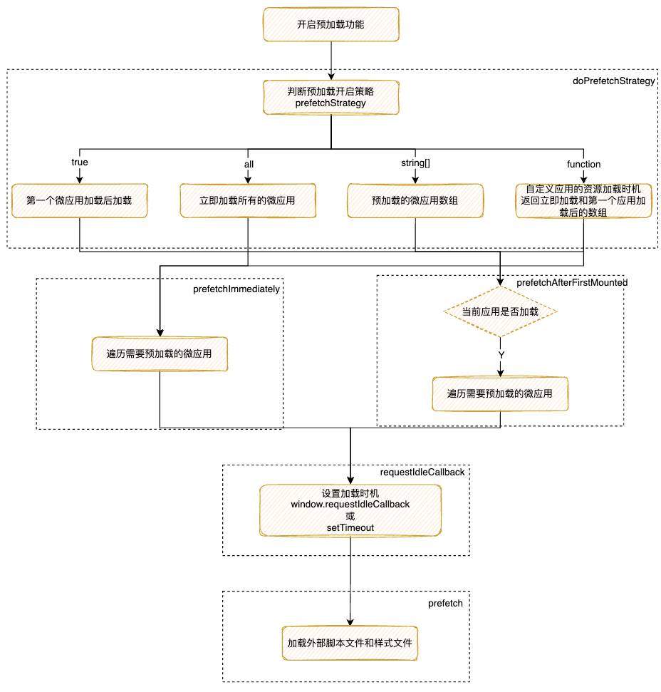
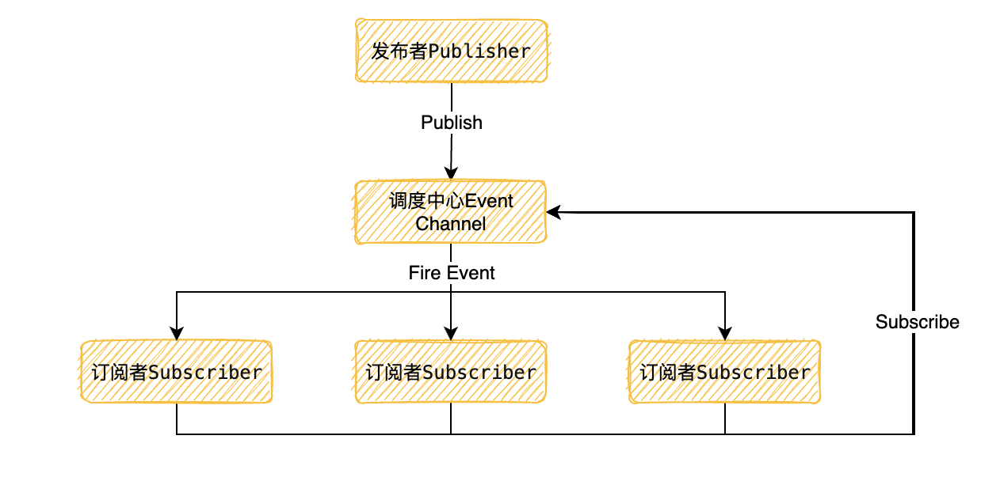
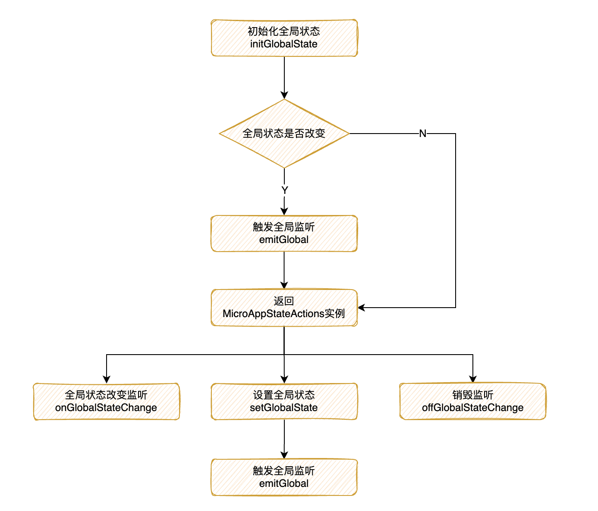

# QianKun中加载流程、预加载以及通信

## 应用加载流程


## 预加载微应用——preFetch

预加载微应用就是在浏览器空闲的时候预加载微应用的静态资源，从而加快微应用打开的速度

也就是当我们打开微应用时从缓存中去拿所需的资源

通过`QianKun`的官方文档我们可以知道有两种方式开启微应用的预加载功能

- 基于路由配置
    
    ```tsx
    import { registerMicroApps, start } from 'qiankun';
    
    registerMicroApps(...)
    
    // 配置预加载,默认为true
    start({ prefetch: true })
    ```
    
    - 配置为 `true` 则会在第一个微应用 mount 完成后开始预加载其他微应用的静态资源
    - 配置为 `'all'` 则主应用 `start` 后即开始预加载所有微应用静态资源
    - 配置为 `string[]` 则会在第一个微应用 mounted 后开始加载数组内的微应用资源
    - 配置为 `function` 则可完全自定义应用的资源加载时机
    
    下面我们进入源码进行解析：
    
    
    
    **一、启动应用**
    
    ```tsx
    export function start(opts: FrameworkConfiguration = {}) {
      frameworkConfiguration = { prefetch: true, singular: true, sandbox: true, ...opts };
      const {
        prefetch,
        sandbox,
        singular,
        urlRerouteOnly = defaultUrlRerouteOnly,
        ...importEntryOpts
      } = frameworkConfiguration;
    	
    	// 如果开启了prefetch预加载，进入预加载策略函数
      if (prefetch) {
        doPrefetchStrategy(microApps, prefetch, importEntryOpts);
      }
    	...
    }
    ```
    
    **二、doPrefetchStrategy：针对开启不同的预加载模式进行加载**
    
    ```tsx
    export function doPrefetchStrategy(
      apps: AppMetadata[],
      prefetchStrategy: PrefetchStrategy,
      importEntryOpts?: ImportEntryOpts,
    ) {
      const appsName2Apps = (names: string[]): AppMetadata[] => apps.filter((app) => names.includes(app.name));
    
    	// prefetchStrategy 是数组
      if (Array.isArray(prefetchStrategy)) {
        prefetchAfterFirstMounted(appsName2Apps(prefetchStrategy as string[]), importEntryOpts); 
      } 
    	// prefetchStrategy 是函数
    	else if (isFunction(prefetchStrategy)) {
        (async () => {
          // critical rendering apps would be prefetch as earlier as possible
          const { criticalAppNames = [], minorAppsName = [] } = await prefetchStrategy(apps);
          prefetchImmediately(appsName2Apps(criticalAppNames), importEntryOpts);
          prefetchAfterFirstMounted(appsName2Apps(minorAppsName), importEntryOpts);
        })();
      } else {
        switch (prefetchStrategy) {
          case true:
            prefetchAfterFirstMounted(apps, importEntryOpts);
            break;
    
          case 'all':
            prefetchImmediately(apps, importEntryOpts);
            break;
    
          default:
            break;
        }
      }
    }
    ```
    
    根据加载的时机不同分为两个方式`prefetchAfterFirstMounted`首个应用加载完毕后开始预加载，另一个是`prefetchImmediately`立即开始预加载
    
    **三、prefetchImmediately/prefetchAfterFirstMounted遍历预加载应用**
    
    - **prefetchImmediately：直接遍历微应用**
    
    ```tsx
    export function prefetchImmediately(apps: AppMetadata[], opts?: ImportEntryOpts): void { 
      ...
    	// 遍历微应用获取入口文件和配置信息开始预加载
      apps.forEach(({ entry }) => prefetch(entry, opts));
    }
    ```
    
    - **prefetchAfterFirstMounted：判断当前微应用是否加载**
    
    ```tsx
    function prefetchAfterFirstMounted(apps: AppMetadata[], opts?: ImportEntryOpts): void {
      // single-spa:first-mount监听应用是否已经加载
    	window.addEventListener('single-spa:first-mount', function listener() {
        // 获取未加载的应用
    		const notLoadedApps = apps.filter((app) => getAppStatus(app.name) === NOT_LOADED);
    
        if (process.env.NODE_ENV === 'development') {
          const mountedApps = getMountedApps();
          console.log(`[qiankun] prefetch starting after ${mountedApps} mounted...`, notLoadedApps);
        }
    
        notLoadedApps.forEach(({ entry }) => prefetch(entry, opts));
    
        window.removeEventListener('single-spa:first-mount', listener);
      });
    }
    ```
    
    区别就在于多了一层判断，是否在当前应用加载前还是加载后
    
    **四、prefetch进行预加载**
    
    ```tsx
    // 开始进行预加载
    function prefetch(entry: Entry, opts?: ImportEntryOpts): void {
      ...
    	// 设置获取外部引入的脚本文件和样式文件的加载时机
      requestIdleCallback(async () => {
        const { getExternalScripts, getExternalStyleSheets } = await importEntry(entry, opts);
        requestIdleCallback(getExternalStyleSheets);
        requestIdleCallback(getExternalScripts);
      });
    }
    
    // 设置加载时间的事件
    const requestIdleCallback =
      window.requestIdleCallback ||
      function requestIdleCallback(cb: CallableFunction) {
        const start = Date.now();
        return setTimeout(() => {
          cb({
            didTimeout: false,
            timeRemaining() {
              return Math.max(0, 50 - (Date.now() - start));
            },
          });
        }, 1);
      };
    ```
    
    核心是调用浏览器的空闲时间进行资源的加载，优先使用`window.requestIdleCallback`，否则通过`setTimeout`
    
- 手动加载
    
    ```tsx
    import { prefetchApps } from 'qiankun';
    
    prefetchApps([
      { name: 'app1', entry: '//localhost:7001' },
      { name: 'app2', entry: '//localhost:7002' },
    ]);
    ```
    
    此处的`prefetchApps`同上面的**`prefetchImmediately`**
    

## 应用通信

常见的通信方式大概分为以下几个：

- `通过URL`：使用简单，操作方便适应于一些不太复杂的场景
- `通过Props`：适用于主子应用之间的传值，当层级结构太深时数据流不清晰
- `通过发布/订阅模式`：一对多的关系，发布者和订阅者是解耦的，使用不当情况下可能会造成数据流的混乱
- `通过状态管理`：统一管理，适合复杂场景
- `通过session、localStorage等`：对存储大小有所限制，容易造成数据的丢失比如存储`function`等

笔者这边就不对`通过URL`、`通过Props`、`通过session、localStorage等`进行详细的说明了，主要是对`通过发布/订阅模式`和`通过状态管理`进行讲解

### 发布/订阅！！



### 简易的发布/订阅

根据上图我们可以知道实现一个发布订阅我们至少需要四个点：

- 一个发布者对象
- 一个订阅者，订阅事件
- 缓存队列存放订阅回调
- 一个调度中心当我们发布消息时遍历缓冲列表，依次通知订阅者

```tsx
class EventEmitter {
    constructor() {
        this.eventMap = new Map()
    }

    subscribe (type, handler) {
        if (!(handler instanceof Function)) {
            throw new Error('handler must be a function!')
        }

        if(!this.eventMap.get(type)) {
            this.eventMap.set(type, [])
        }

        this.eventMap.get(type).push(handler)
    }

    emit (type, ...args) {
        const queue = this.eventMap.get(type)
        if(queue) {
            queue.forEach(handler => {
                handler(...args)
            });
        }
    }

    unSubscribe (type, handler) {
        if (handler) {
            const queue = this.eventMap.get(type)
            queue.splice(queue.indexOf(handler), 1)
        } else {
            this.eventMap.delete(type)
        }
    }
}

const myEvent = new EventEmitter()

const handler = (...args) => {
    console.log('事件被触发了', ...args)
}

myEvent.subscribe('test', handler)

myEvent.emit('test', 'lalalla')

// 事件被触发了 lalalla
```

### QianKun中的*initGlobalState*

通过阅读`QianKun`的文档我们可以知道，在`QianKun`中我们是通过****`initGlobalState(state)`****
定义全局状态的，通过该方法返回一个`MicroAppStateActions`实例，并且一次暴露三个方法：

- **onGlobalStateChange：全局依赖监听**
- **setGlobalState：设置全局状态**
- **offGlobalStateChange：销毁监听**

从本质上来看其实*`initGlobalState`也是遵循了发布订阅模式*

我们看下官方示例：

主应用：

```tsx
import { initGlobalState, MicroAppStateActions } from 'qiankun';

// 初始化 state
const actions: MicroAppStateActions = initGlobalState(state);

actions.onGlobalStateChange((state, prev) => {
  // state: 变更后的状态; prev 变更前的状态
  console.log(state, prev);
});
actions.setGlobalState(state);
actions.offGlobalStateChange();
```

子应用：

```tsx
// 从生命周期 mount 中获取通信方法，使用方式和 master 一致
export function mount(props) {
  props.onGlobalStateChange((state, prev) => {
    // state: 变更后的状态; prev 变更前的状态
    console.log(state, prev);
  });

  props.setGlobalState(state);
}
```

`onGlobalStateChange`对应简易的发布订阅中的`subscribe`，`setGlobalState`对应`publish`

下面我们进入源码看看是如何实现的：



这里有两个值提前说明以下：

- globalState：全局状态
- deps：函数缓存列表

*`initGlobalState`*：初始化全局的State

```tsx
export function initGlobalState(state: Record<string, any> = {}) {
	...
  if (state === globalState) {
    console.warn('[qiankun] state has not changed！');
  } else {
    const prevGlobalState = cloneDeep(globalState);
    globalState = cloneDeep(state);
		// 触发全局监听
    emitGlobal(globalState, prevGlobalState); 
  }
	// 返回MicroAppStateActions实例
  return getMicroAppStateActions(`global-${+new Date()}`, true);
}
```

`emitGlobal`：触发全局回调

```tsx
function emitGlobal(state: Record<string, any>, prevState: Record<string, any>) {
  Object.keys(deps).forEach((id: string) => {
    if (deps[id] instanceof Function) {
			// 触发全局状态改变后的回调函数
      deps[id](cloneDeep(state), cloneDeep(prevState));
    }
  });
}
```

`getMicroAppStateActions`：返回MicroAppStateActions实例

- **`onGlobalStateChange`**：**全局依赖监听**
    
    ```tsx
    onGlobalStateChange(callback: OnGlobalStateChangeCallback, fireImmediately?: boolean) {
        ...
    		// 把回调函数存入缓存列表中
        deps[id] = callback;
    		// 当设置fireImmediately为true时，立即执行回调函数
        if (fireImmediately) {
          const cloneState = cloneDeep(globalState);
          callback(cloneState, cloneState);
        }
      }
    ```
    
- **`setGlobalState`**：**设置全局状态**
    
    ```tsx
    setGlobalState(state: Record<string, any> = {}) {
      if (state === globalState) {
        console.warn('[qiankun] state has not changed！');
        return false;
      }
    
      const changeKeys: string[] = [];
      const prevGlobalState = cloneDeep(globalState);
    	// 返回合并以后新的state
      globalState = cloneDeep(
        Object.keys(state).reduce((_globalState, changeKey) => {
    			// 主应用更改或者是globalState的属性
          if (isMaster || _globalState.hasOwnProperty(changeKey)) {
            changeKeys.push(changeKey);
            return Object.assign(_globalState, { [changeKey]: state[changeKey] });
          }
          console.warn(`[qiankun] '${changeKey}' not declared when init state！`);
          return _globalState;
        }, globalState),
      );
      if (changeKeys.length === 0) {
        console.warn('[qiankun] state has not changed！');
        return false;
      }
    	// 触发全局状态改变后的回调函数
      emitGlobal(globalState, prevGlobalState);
      return true;
    }
    ```
    
    他这里的处理只希望主应用去新增值，微应用去变更已经有的值
    
- **`offGlobalStateChange`**：销毁**监听**
    
    ```tsx
    offGlobalStateChange() {
      delete deps[id];
      return true;
    }
    ```
    
- 挂载到子应用的props
    
    ```tsx
    // loadApp
    const { onGlobalStateChange, setGlobalState, offGlobalStateChange }: Record<string, CallableFunction> =
    	   getMicroAppStateActions(appInstanceId);
    
    // mount阶段
    async (props) => mount({ ...props, container: appWrapperGetter(), setGlobalState, onGlobalStateChange })
    
    ```
    

### 状态管理

由于这部分不涉及源码，因此这边只讲个思路

在主应用中增加状态管理，比如如果主应用是`Vue`的话就是`vuex store`，`React`的话就把`redux`中的`store`传下去

1、****主应用向微应用传递`store`实例，有**两种传值方式

- 基于路由配置
    
    ```tsx
    registerMicroApps(
      [
        {
          name: 'app1',
          entry: '//localhost:8080',
          container: '#container',
          activeRule: '/react',
          props: {
    				// 放在这里，props里的值为主应用传给子应用的数据
            store: store,
          },
        },
      ],
      {
        beforeLoad: (app) => console.log('before load', app.name),
        beforeMount: [(app) => console.log('before mount', app.name)],
      },
    );
    ```
    
- 手动加载
    
    ```tsx
    loadMicroApp({
      name: 'app1',
      entry: '//localhost:1234',
      container: this.containerRef.current,
      props: { store: store },
    })
    ```
    

2、子应用使用主应用的`store`****实例****

```tsx
// 在mount生命周期获取
function mount(props) {
  // 此时props中含有store
  render(props);
}

// render中使用
function render(props) {
	// 对store进行处理
  const { container } = props;
  ReactDOM.render(<App />, container ? container.querySelector('#root') : document.querySelector('#root'));
}
```