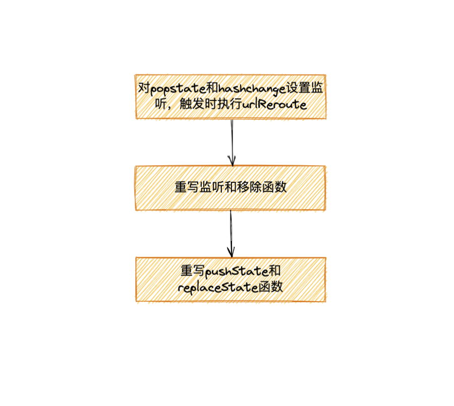
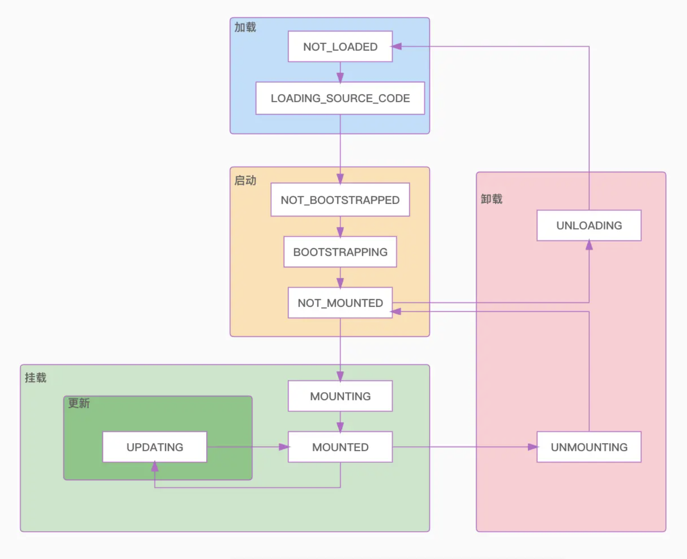
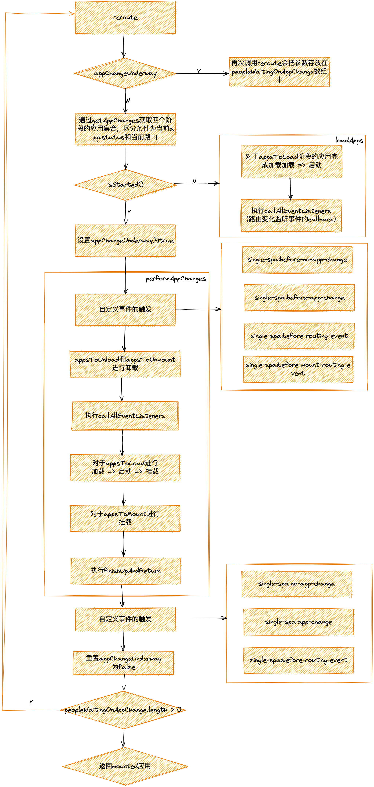

# single-spa中的路由实现

> 笔者今天为什么要介绍`single-spa`中的路由呢，在对`QianKun`的源码分析中，笔者发现`QianKun`未对路由进行实现，主要还是调用`single-spa`中的路由。为了更好的了解微前端的机制，我们有必要对路由这块进行解读，在解读`single-spa`实现方式之前，笔者先带大家了解下一些路由的前置知识。
> 

Tips：本文中所涉及的`single-spa`的版本为`v5.9.3`

## 路由的前置知识

我们先来聊一聊要实现一个路由主要需要做到哪几个部分呢？

一、当url变化的时候，保持UI界面的同步更新，即加载对应的内容

二、当浏览器刷新的时候，保持当前url地址，并且加载相应的内容

三、浏览器前进后退时，加载相应的内容

而在浏览器中，常见的路由主要分为两种：

- Browser Router
- Hash Router

### Browser Router

该方式主要是由`window`对象的`history`对象提供的，主要是提供了对浏览器会话历史的访问，同时支持以下操作：

- 向前跳、向后跳以及跳转到会话历史的某个点
    
    ```jsx
    // 向前
    window.history.back();
    
    // 向后
    window.history.forward();
    
    // 跳转到某个点，当前页面的相对位置为0
    window.history.go(-1)
    
    // 查看浏览器会话历史的页数
    window.history.length
    ```
    
- 添加会话历史
    
    ```jsx
    // 结合onpopstate可以获得state值
    const state = {
    	page: 1
    }
    // 大多数浏览器忽略，目前被忽略
    const title = ''
    // 跳转的地址
    const url = '?page=1'
    
    history.pushState(state, title, url);
    ```
    
    Tips：只会修改url不会去检查url是否存在以及加载页面
    
- 修改会话历史
    
    ```jsx
    // 这个和上面的添加历史会话使用相同，不同在于修改当前历史会话的url的信息
    
    const state = {
    	page: 2
    }
    const title = ''
    const url = '?page=2'
    
    history.replaceState(state, title, url);
    ```
    
    Tips：只会修改url不会去检查url是否存在以及加载页面
    
- 监听会话历史的变化
    
    ```jsx
    window.onpopstate = function(event) {
      alert("location: " + document.location + ", state: " + JSON.stringify(event.state));
    }
    
    window.addEventListener("popstate", function(event) {
      alert("location: " + document.location + ", state: " + JSON.stringify(event.state));
    });
    ```
    
    Tips：不会在`history.pushState`和`history.replaceState`触发
    

详情可以点击：**[History API](https://developer.mozilla.org/zh-CN/docs/Web/API/History_API)**

### Hash Router

主要是根据`location.hash`的变化来进行页面的更新，该路由的变化主要是通过监听`hashchange`事件

```jsx
window.addEventListener('hashchange', function (event) {
    // ...
})

window.onhashchange = function (event) { 
    // ... 
}
```

详情可以点击：**[Window: hashchange event](https://developer.mozilla.org/zh-CN/docs/Web/API/Window/hashchange_event)**

## single-spa中的路由机制

经过👆的讲述，显然我们实现路由机制需要对路由进行监听，而`single-spa`是支持`Browser Router`以及`Hash Router`两种路由方式的，即对`popstate`和`hashchange`进行监听

### 基本流程



以上流程其实做的事情很简单：

1、第一个步骤设置监听，执行`urlReroute`是为了先让注册的微应用实现生命周期的转化，比如加载⇒启动、启动⇒挂载等

2、重写监听和移除函数，是为了收集微应用中路由监听的回调事件，存储起来在某一时刻再执行

3、重写`pushState`和`replaceState`主要是为了在路由变更的时候去触发微应用的加载

### 对`popstate`和`hashchange`进行监听

src/navigation/navigation-events.js

```jsx
// 监听的路由事件数组
export const routingEventsListeningTo = ["hashchange", "popstate"];

// 记录路由回调
const capturedEventListeners = {
  hashchange: [],
  popstate: [],
}

// 重载路由事件
function urlReroute() {
  reroute([], arguments);
}
```

```jsx
if (isInBrowser) {
  // 对hashchange以及popstate设置监听，这边回调的处理暂时不看
  window.addEventListener("hashchange", urlReroute);
  window.addEventListener("popstate", urlReroute);

  // 重写window.addEventListener以及window.removeEventListener方法，收集应用中路由变化的监听回调
  const originalAddEventListener = window.addEventListener;
  const originalRemoveEventListener = window.removeEventListener;

  window.addEventListener = function (eventName, fn) {
		// 记录回调函数到capturedEventListeners中
    if (typeof fn === "function") {
      if (
        routingEventsListeningTo.indexOf(eventName) >= 0 &&
        !find(capturedEventListeners[eventName], (listener) => listener === fn)
      ) {
        capturedEventListeners[eventName].push(fn);
        return;
      }
    }

    return originalAddEventListener.apply(this, arguments);
  };

  window.removeEventListener = function (eventName, listenerFn) {
    if (typeof listenerFn === "function") {
			// 移除路由监听的回调函数
      if (routingEventsListeningTo.indexOf(eventName) >= 0) {
        capturedEventListeners[eventName] = capturedEventListeners[
          eventName
        ].filter((fn) => fn !== listenerFn);
        return;
      }
    }

    return originalRemoveEventListener.apply(this, arguments);
  };

	// 对pushState以及replaceState进行重写
  window.history.pushState = patchedUpdateState(
    window.history.pushState,
    "pushState"
  );

  window.history.replaceState = patchedUpdateState(
    window.history.replaceState,
    "replaceState"
  );
	......
}
```

### 对pushState和replaceState的自定义处理

进入patchedUpdateState

```jsx
function patchedUpdateState(updateState, methodName) {
  return function () {
    const urlBefore = window.location.href;
    const result = updateState.apply(this, arguments);
    const urlAfter = window.location.href;

    if (!urlRerouteOnly || urlBefore !== urlAfter) {
			// single-spa是否已经启动
      if (isStarted()) {
				// 触发PopState事件
        window.dispatchEvent(
          createPopStateEvent(window.history.state, methodName)
        );
      } else {
        reroute([]);
      }
    }

    return result;
  };
}

function createPopStateEvent(state, originalMethodName) {
  let evt;
  try {
    evt = new PopStateEvent("popstate", { state });
  } catch (err) {
    // 兼容处理
    evt = document.createEvent("PopStateEvent");
    evt.initPopStateEvent("popstate", false, false, state);
  }
  evt.singleSpa = true;
  evt.singleSpaTrigger = originalMethodName;
  return evt;
}
```

目的：使`history.pushState`和`history.replaceState`也会触发`popstate`事件

Q1：为什么要对isStarted进行判断？

```tsx
let started = false;

export function start(opts) {
  started = true;
  if (opts && opts.urlRerouteOnly) {
    setUrlRerouteOnly(opts.urlRerouteOnly);
  }
  if (isInBrowser) {
    reroute();
  }
}

export function isStarted() {
  return started;
}
```

官方文档中是这么说的：在调用 `start`之前, 应用会被加载, 但不会初始化，挂载或卸载。 `start`的原因是让你更好的控制你单页应用的性能。比如：你在注册应用之后，需要先去某些接口（比如获取登陆用户的信息），然后才是挂载相应的应用。

### **路由重载的回调reroute**

- 对处于不同生命周期的微应用进行生命周期的变更
- 处理收集的`hashchange`和`popstate`的回调事件
- 触发自定义事件

### 基本流程

- 关键点说明
    - appChangeUnderway：是否有应用由于**`reroute`**生命周期处于变更阶段，当存在时后续的**`reroute`**将会返回promise，并且把参数存入`peopleWaitingOnAppChange`数组中进行等待
    - getAppChanges：根据app.status和当前路由把所以应用划分为四个数组
        - appsToUnload：处于`NOT_BOOTSTRAPPED`和`NOT_MOUNTED`的状态，并且和当前URL不匹配的应用
        - appsToUnmount：处于`MOUNTED`阶段并且和当前URL不匹配的应用
        - appsToLoad：处于`NOT_LOADED`或者是`LOADING_SOURCE_CODE`的资源，并且和当前URL匹配的应用
        - appsToMount：处于`NOT_BOOTSTRAPPED`和`NOT_MOUNTED`的状态，并且和当前URL匹配的应用
        
        
        
        应用加载状态的流程图：
        
        注：出自[https://juejin.cn/post/7074172393001861133](https://juejin.cn/post/7074172393001861133)
        
        除上面10个状态以外，还有两个状态是在发生错误时定义的
        
        ```jsx
        export const LOAD_ERROR = "LOAD_ERROR";
        export const SKIP_BECAUSE_BROKEN = "SKIP_BECAUSE_BROKEN";
        ```
        
    - isStarted：是否调用了`single-spa`的`start`方法，如果调用说明接下来使用single-spa渲染应用
- 具体流程图



`single-spa:before-no-app-change`**：**在本次`reroute`的时候，没有应用发生生命周期的转变

`single-spa:before-app-change`：在本次`reroute`的时候，有应用发生生命周期的转变

`single-spa:before-routing-event`：只要`reroute`就回触发

`single-spa:before-mount-routing-event`：执行完`appsToUnload`和`appsToUnmount`中所有的异步方法后，表示后续要开始加载应用了

`single-spa:no-app-change`：在本次`reroute`的时候，没有应用发生生命周期的转变（转变完成之后）

`single-spa:app-change`：在本次`reroute`的时候，有应用发生生命周期的转变（转变完成之后）

`single-spa:routing-event`：发生在`reroute` 结束的时候

Tips：以上都是基于进入了`performAppChanges`前提下

- 源码解析

```jsx
export function reroute(pendingPromises = [], eventArguments) {
  // 是否处于reroute中
  if (appChangeUnderway) {
		// 返回promise，存储到peopleWaitingOnAppChange，reroute之后再进行执行
    return new Promise((resolve, reject) => {
      peopleWaitingOnAppChange.push({
        resolve,
        reject,
        eventArguments,
      });
    });
  }

	// 获取所有的的微应用状态，存入四个状态的数组中
  const {
    appsToUnload,
    appsToUnmount,
    appsToLoad,
    appsToMount,
  } = getAppChanges();  

  let appsThatChanged,
    navigationIsCanceled = false,
    oldUrl = currentUrl,
    newUrl = (currentUrl = window.location.href);

	// 判断single-spa是否启用
  if (isStarted()) {
    appChangeUnderway = true;
    appsThatChanged = appsToUnload.concat(
      appsToLoad,
      appsToUnmount,
      appsToMount
    );
    return performAppChanges();
  } else {
    appsThatChanged = appsToLoad;
    return loadApps();
  }
	...
}
```

### 加载应用loadApps

- 执行加载应用的事件
- 加载完成后执行`callAllEventListeners`即监听路由变化的回调事件

```jsx
export function reroute(pendingPromises = [], eventArguments) {
	// ...
	function loadApps() {
	    return Promise.resolve().then(() => {
	      const loadPromises = appsToLoad.map(toLoadPromise);
	
	      return (
	        Promise.all(loadPromises)
	          .then(callAllEventListeners)
	          .then(() => [])
	          .catch((err) => {
	            callAllEventListeners();
	            throw err;
	          })
	      );
	    });
	  }
	
	function callAllEventListeners() {
	  pendingPromises.forEach((pendingPromise) => {
	    callCapturedEventListeners(pendingPromise.eventArguments);
	  });
	
	  callCapturedEventListeners(eventArguments);
	}
	...
}

// 执行设置路由的回调事件
export function callCapturedEventListeners(eventArguments) {
  if (eventArguments) { 
    const eventType = eventArguments[0].type;
    if (routingEventsListeningTo.indexOf(eventType) >= 0) {
      capturedEventListeners[eventType].forEach((listener) => {
        try {
          listener.apply(this, eventArguments);
        } catch (e) {
          setTimeout(() => {
            throw e;
          });
        }
      });
    }
  }
}

export const routingEventsListeningTo = ["hashchange", "popstate"];
const capturedEventListeners = {
  hashchange: [],
  popstate: [],
}
```

**toLoadPromise的主要作用**

- 应用状态码从`LOADING_SOURCE_CODE` ⇒ `NOT_BOOTSTRAPPED`
- 执行`app.**loadApp**`
- 为app添加`bootstrap`、`mount`、`unmount`、`unload`生命周期方法

### 执行performAppChanges

- 自定义事件的触发
- 对不同阶段的应用进行处理
- 执行`callAllEventListeners`
- 最终执行`finishUpAndReturn`

```jsx
function performAppChanges() {
    return Promise.resolve().then(() => {
      // 一些自定义事件的触发
      window.dispatchEvent(
        new CustomEvent(
          appsThatChanged.length === 0
            ? "single-spa:before-no-app-change"
            : "single-spa:before-app-change",
          getCustomEventDetail(true)
        )
      );
			...
			// 对于appsToLoad阶段的应用进行加载 => 启动 => 挂载
      const loadThenMountPromises = appsToLoad.map((app) => {
        return toLoadPromise(app).then((app) =>
          tryToBootstrapAndMount(app, unmountAllPromise)
        );
      });

			// 对于appsToMount阶段的应用挂载
      const mountPromises = appsToMount
        .filter((appToMount) => appsToLoad.indexOf(appToMount) < 0)
        .map((appToMount) => {
          return tryToBootstrapAndMount(appToMount, unmountAllPromise);
        });

			// 卸载应用 => 执行callAllEventListeners => 执行loadThenMountPromises和mountPromises => finishUpAndReturn
      return unmountAllPromise
        .catch((err) => {
          callAllEventListeners();
          throw err;
        })
        .then(() => {
          callAllEventListeners();

          return Promise.all(loadThenMountPromises.concat(mountPromises))
            .catch((err) => {
              pendingPromises.forEach((promise) => promise.reject(err));
              throw err;
            })
            .then(finishUpAndReturn);
        });
    });
  }
```

**finishUpAndReturn**

- 触发自定义事件
- 重置*`appChangeUnderway`*
- 对于**peopleWaitingOnAppChange中的事件，调用reroute进行处理**

```jsx
function finishUpAndReturn() {
    const returnValue = getMountedApps();
    pendingPromises.forEach((promise) => promise.resolve(returnValue));

		// 触发自定义事件
    try {
      const appChangeEventName =
        appsThatChanged.length === 0
          ? "single-spa:no-app-change"
          : "single-spa:app-change";
      window.dispatchEvent(
        new CustomEvent(appChangeEventName, getCustomEventDetail())
      );
      window.dispatchEvent(
        new CustomEvent("single-spa:routing-event", getCustomEventDetail())
      );
    } catch (err) {
      setTimeout(() => {
        throw err;
      });
    }

    // 重置appChangeUnderway
    appChangeUnderway = false;
	
		// 调用reroute处理peopleWaitingOnAppChange
    if (peopleWaitingOnAppChange.length > 0) {
      const nextPendingPromises = peopleWaitingOnAppChange;
			// 重置为空数组
      peopleWaitingOnAppChange = [];
      reroute(nextPendingPromises);
    }
		...
  }
```